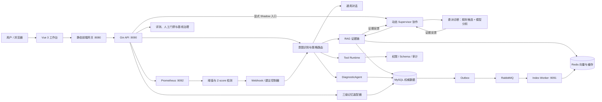

# GopherAI DevSupport

GopherAI DevSupport 是一个面向研发与运维场景的可治理 Agent 系统。它把项目知识问答、故障诊断、工具调用、分层记忆、策略路由、运行观测和离线评测放进同一条可审计链路，重点解决传统聊天机器人“能回答，但无法说明依据、控制权限或衡量效果”的问题。

在线实例：[http://101.200.145.78:8080/dashboard](http://101.200.145.78:8080/dashboard)
运行工作台页面如下：


> 在线实例是单机工程演示环境，可能因云主机维护而短时不可用。仓库当前主开发分支为 `add_eico`。

## 解决的问题

研发支持类问题通常同时涉及文档、配置、日志、运行状态和操作权限。例如，“核对发布配置并诊断 HTTP 502”既需要从项目文档提取证据，也需要形成诊断假设，还可能需要调用只读工具验证环境。

GopherAI 将这类请求处理为一条受约束的工作流：

1. 多策略意图识别判断请求属于通用对话、项目问答、故障诊断或工具任务。
2. 路由策略选择正式处理链路，同时运行不切流的 Shadow 策略用于比较。
3. RAG、DiagnosticAgent 或有限多 Agent 协作在预算与权限边界内执行。
4. 回答必须满足证据门控；证据不足时明确拒绝形成确定性结论。
5. Trace、指标、用户反馈和离线评测共同进入观测闭环，只生成可审核的策略建议。

这使系统的核心价值不只是“调用大模型”，而是让模型行为可以追踪、复现、比较和治理。

## 核心能力

| 能力 | 实现方式 | 可观察结果 |
| --- | --- | --- |
| 多策略意图识别 | 规则、高置信命中、安全降级与 Shadow 判定并存 | 页面同时展示实际路由和影子判断，Shadow 默认不切流 |
| RAG 证据问答 | 混合检索、父子块补充、证据融合、引用校验和权限过滤 | 回答附引用；单路或不足证据触发拒答，不让模型补猜 |
| 动态多 Agent 协作 | Supervisor 模型生成子任务，在 KnowledgeAgent 与 DiagnosticAgent 之间选择串行/并行，按返回证据再次委派 | 具体任务、跨轮证据交接、引用合并、预算停止与审计可见；旧固定流程保留作对照 |
| 故障诊断 Harness | 历史案例只用于候选增强，当前证据与验证动作保持独立 | 输出根因候选、验证步骤、置信边界和安全回退 |
| RCAEval 自主排查实验 | 单 Agent 多轮决策、按需查询指标/日志/调用链/历史案例、证据引用校验 | 实际工具顺序、假设更新、候选原因、停止边界与独立评分；旧规则保留作对照 |
| 受治理工具 | 工具注册表、JSON Schema、RBAC、风险等级、预算、审计与熔断 | 未注册、越权或高风险调用在执行前被阻断 |
| 三级对话记忆 | Working、Episodic、Profile 三层装配，带所有权、TTL、删除语义和 Token 预算 | 可查看召回、注入、排除及跨用户隔离指标 |
| 可观测性闭环 | Prometheus 指标、固定阈值、滑动窗口 Z-score、告警事件与控制 Webhook | 异常形成 recommend-only 建议，不直接修改在线策略 |
| AI 系统评测 | 320 条目录、300 条可执行用例、人工复核、LLM-as-a-Judge 校准、基线审批与固定重跑 | 数据版本、审批、运行报告和 Hash 可追溯 |

## 系统架构



### 一次请求如何流转

```text
请求
  → 意图判定
  → 正式策略路由 + Shadow 候选
  → 证据检索 / 诊断 / 工具计划
  → 权限、预算、Schema 与引用门控
  → 生成或安全拒答
  → Trace、指标、反馈和评测样本
  → recommend-only 策略建议
  → 离线评测与人工审批后才允许进入新基线
```

正式路由决定本次线上回答；Shadow 只记录“新策略原本会如何选择”，不会暗中改变结果。监控闭环同样默认停在建议阶段，避免短期噪声直接改变生产行为。

## 技术栈

| 层次 | 技术 |
| --- | --- |
| 后端 | Go 1.24、Gin 1.11、Eino 0.5、GORM、JWT |
| 前端 | Vue 3、Vue CLI 5、Webpack、Vue Router 4、Element Plus、Axios |
| 模型接入 | OpenAI-compatible Chat / Embedding API |
| 权威存储 | MySQL：文档、索引任务、Agent Run、Checkpoint、策略、复核和审计 |
| 检索与缓存 | Redis：向量索引与可重建缓存，不作为业务事实源 |
| 异步任务 | RabbitMQ + Transactional Outbox：索引任务、重试和失败池 |
| 可观测性 | Prometheus 指标、Grafana、结构化日志、Trace ID、固定阈值与滑动窗口 Z-score |
| MCP 子模块 | Go 1.25，独立构建并仅通过受治理运行时暴露能力 |

## 工作台页面

登录后由 `/dashboard` 进入深色工业看板。各能力使用独立路由，避免把所有面板堆叠在聊天页面。

| 路由 | 用途 |
| --- | --- |
| `/dashboard/chat` | 智能路由、知识库回答与对话 Trace |
| `/dashboard/history` | 历史会话管理 |
| `/dashboard/knowledge` | 文档上传、索引状态、证据检索和多种 RAG 回答模式 |
| `/dashboard/diagnostics` | 原故障诊断 Harness 与状态管理 |
| `/dashboard/collaboration` | 动态双 Agent 委派、证据反馈、逐轮轨迹与只读结果 |
| `/dashboard/rca-experiment` | 自主排查 Agent、逐轮证据与假设更新、历史案例和规则对照 |
| `/dashboard/memory` | Working / Episodic / Profile 记忆状态与隔离指标 |
| `/dashboard/tools` | 工具目录、治理规则、调用记录和审计结果 |
| `/dashboard/policy` | 权威策略、稳定分桶、Shadow 演算与反馈建议 |
| `/dashboard/evaluation` | 离线评测、门禁、漂移检测和固定重跑结果 |
| `/dashboard/review` | Full 目录复核与 Judge 人工校准 |
| `/dashboard/settings` | 系统配置与运行信息 |

旧入口 `/menu` 和 `/ai-chat` 会重定向到新工作台，已有鉴权守卫继续生效。

动态协作仅升级原双 Agent：最多 5 次 Supervisor 调用、4 次委派、同轮 2 个固定角色、180 秒总超时。KnowledgeAgent 查询授权文档；DiagnosticAgent 结合用户报告、规则候选与交接证据进行模型分析，不访问现场主机或执行修复。控制审计写 MySQL，完整本次轨迹可下载。接口采用显式 Shadow，不改变正式聊天或自动批准策略。详见[动态协作规格与验收](docs/DYNAMIC-COLLABORATION-SPEC.zh-CN.md)。下述历史评测数字不代表这一新版本的诊断准确率或质量收益。

## 已验证的评测结果

以下数据来自 2026-09-09 封存的 `devsupport-eval-v1` 固定重跑，不是 README 中手工填写的演示数字。目录、人工复核集合、封存记录和运行报告均有 SHA-256 标识，可用于复现和审计。

### 数据与运行完整性

| 项目 | 结果 |
| --- | --- |
| 评测目录 | 320 / 320 校验通过 |
| 可执行用例 | 300 / 300 执行完成 |
| 目录执行覆盖率 | 93.75%（其余 20 条为只做目录治理的安全边界用例） |
| Full 人工复核 | 320 通过、0 退回、0 待处理 |
| 固定重跑 | Intent、RAG、Diagnosis、Tool、Memory、Unified 共 6 / 6 步通过 |
| Unified 决策 | 满足基线候选条件；未授权自动切换默认流量 |

### 分能力指标

| 切片 | 关键指标 | 结果 |
| --- | --- | --- |
| 意图识别（150） | Accuracy / Macro-F1 / 最低类别 Recall | 96.00% / 95.97% / 91.67% |
| RAG（60） | Recall@5 / nDCG@5 / 引用覆盖 / 无依据回答 | 100% / 95.99% / 100% / 0% |
| 故障诊断（40） | 根因 Top-3 Recall / 必要步骤覆盖 / 验证动作准确率 | 100% / 93.75% / 97.50% |
| 工具治理（30） | 工具选择 / Schema / 韧性 / 危险动作 | 100% / 100% / 100% / 0 |
| 三级记忆（20） | 相关记忆召回 / 错误注入 / 跨主体泄漏 | 100% / 0% / 0 |

Judge 人工校准为 30 / 30，精确一致率 56.67%，相邻等级一致率 83.33%，线性加权 Kappa 为 `0.6177`。由于低于 `0.70` 门槛，LLM-as-a-Judge 只能作为辅助信号，不能自动审批基线。这一结果被保留而不是美化，体现了评测系统对自身评委可靠性的约束。

关键审计标识：

```text
Catalog SHA       69e5d1d9ea6102e2fdb12f23ebd0303a175e8d8f4e744a2edb3387ad422e7bb7
Review Set SHA    99abb5eac78e518120fce831ee0cca5ea3d6f91afc921c3143aef519f552bcc7
Seal ID           catalog-seal-9347cccd1154294783263fbeabcb50fc
Seal SHA          7388527fc11db6072170c104d0fd440a789114db981d1d4a1d3bedd47ce9035b
Rerun ID          rerun-20260909T043921.016655656Z-4bbfb670
Rerun Report SHA  6b46cbdd815db0f46b36e42d1b4243df29ae448cc64ce7cc716613402f8ee371
```

评测集的组成、Hash/Schema 规则及运行方式见 [evals/README.md](evals/README.md)。

### 外部公开数据：已知故障案例辅助排查

另设独立的 [RCAEval 实验](evals/rcaeval/README.md)，不混入上述 320 条契约评测。选取公开 Online Boutique 故障注入数据的 27 次运行：6 条参考、9 条开发、12 条留出；限定两个服务的 CPU、内存和网络延迟三类模式。

原确定性规则版首次留出结果：6 个范围内案例，历史增强方案服务与类型同时正确 **6/6**，观测特征对照为 **5/6**。但 6 个范围外案例中仍有 **4/6 误接纳**。这些数字不属于新自主 Agent，不是生产准确率或未知故障泛化。

新增的 **自主排查 Agent** 通过 Eino 模型接口执行有界的“决策 → 只读工具 → 新证据 → 更新假设”循环。模型选择工具及目标服务，不接收旧规则答案；Go Harness负责参数、权限、重复调用、预算、超时和引用归属检查。最多8次模型请求、6次工具、180秒；失败不会自动用规则答案替代。每轮仅展示简短可核对的假设更新，不展示模型内部思维链。

原始约278 MB数据本地处理，ECS只保存小型观测摘要，模型在云端调用，不新增数据库或运行完整微服务集群。此入口复用既有模型凭证；原聊天配置为百炼 `qwen-turbo` 时，仅此入口默认采用 `qwen-plus`，可用服务端 `GOPHERAI_RCA_MODEL` 覆盖，普通聊天不变。会产生真实模型调用用量。

当前12例答案此前已被查看，因此新模型成绩只作为**已有案例回放**单独记录，不称为新盲测。查看 [自主排查规格](docs/RCAEval-AUTONOMOUS-AGENT-SPEC.zh-CN.md) 和 [实验说明](evals/rcaeval/README.md)。最终标准答案由独立评分器核对，不进入模型上下文；不执行修复。

当前 `rca-autonomous-agent-v2` / qwen-plus 的一次完整回放：**10/12 执行完成**；6个已知类型案例服务 Top-1 **6/6**、服务与类型同时正确 **4/6**。6个范围外案例中 **4个误接纳、2个执行失败**，不能把失败算作正确拒答。全部87次模型请求及轨迹保存于 [agent-replay.json](evals/rcaeval/agent-replay.json)；此前两轮较差的回放也保留。这证明有限样本上的迭代辅助排查过程可运行，但**不证明优于原规则，也不具备可靠的未知故障识别能力**。页面可回看真实记录，或发起新调用；两者有显著区分。

## 本地启动

### 前置条件

- Go 1.24.x；构建 `common/mcp` 子模块时需要 Go 1.25.x
- Node.js 与 npm
- MySQL 8.x
- Redis（启用向量检索所需模块）
- RabbitMQ
- 一个兼容 OpenAI Chat/Embedding 接口的模型服务

仓库不提供通用 `docker-compose.yml`。MySQL、Redis 和 RabbitMQ 可以使用本机服务或独立容器，但应由使用者显式配置，避免隐藏基础设施假设。

### 配置

编辑 `config/config.toml`，不要提交真实密码、JWT Key 或模型密钥。示例结构如下：

```toml
[mainConfig]
appName = "GopherAI"
host = "127.0.0.1"
port = 9090
contextTokenBudget = 8192

[mysqlConfig]
host = "127.0.0.1"
port = 3306
user = "gopherai"
password = "<mysql-password>"
databaseName = "gopherai"
charset = "utf8mb4"

[redisConfig]
host = "127.0.0.1"
port = 6379
password = "<redis-password>"
db = 0

[rabbitmqConfig]
host = "127.0.0.1"
port = 5672
username = "gopherai"
password = "<rabbitmq-password>"
vhost = "/"

[jwtConfig]
expire_duration = 24
issuer = "gopherai"
subject = "gopherai-user"
key = "<long-random-jwt-key>"

[ragModelConfig]
embeddingModel = "<embedding-model>"
chatModelName = "<chat-model>"
baseUrl = "<openai-compatible-base-url>"
dimension = 1024
docDir = "data/documents"
```

模型密钥通过环境变量提供：

```powershell
$env:OPENAI_API_KEY = "<api-key>"
$env:GOPHERAI_ENV = "development"
```

如果启用外部控制 Webhook，可另外配置 `GOPHERAI_CONTROL_WEBHOOK_URL`、`GOPHERAI_CONTROL_WEBHOOK_SECRET_FILE` 和 `GOPHERAI_CONTROL_WEBHOOK_LOOPBACK_RECEIVER`。密钥应放在权限受限的文件中，而不是写入仓库。

### 启动顺序

先启动 MySQL、Redis 和 RabbitMQ，再分别运行以下进程。

后端 API：

```powershell
go run .
```

异步索引 Worker：

```powershell
go run ./cmd/index-worker
```

MCP 服务：

```powershell
Set-Location common/mcp
go run . -mode server
```

开发模式前端：

```powershell
Set-Location vue-frontend
npm ci
npm run serve
```

生产式本地预览可先执行 `npm run build`，再由前端网关提供静态资源并反向代理 API：

```powershell
go run ./cmd/frontend-gateway -listen :8080 -backend http://127.0.0.1:9090 -dist vue-frontend/dist
```

### 健康检查

```powershell
Invoke-RestMethod http://127.0.0.1:9090/health/live
Invoke-RestMethod http://127.0.0.1:9090/health/ready
Invoke-WebRequest http://127.0.0.1:9090/metrics
```

`/health/live` 只判断进程是否存活；`/health/ready` 会汇总模型配置、MySQL、RabbitMQ、Redis 缓存与 Redis 向量链路的就绪状态。

## API 概览

除注册、登录和健康检查外，业务接口均受 JWT 鉴权保护。

| 前缀 | 说明 |
| --- | --- |
| `/api/v1/user` | 注册、登录和验证码 |
| `/api/v1/chat` | 普通、自动路由与流式对话 |
| `/api/v1/knowledge` | 文档、索引任务、检索、证据回答和深度回答 |
| `/api/v1/agent-runs` | Agent 运行、协作计划、Checkpoint、恢复和取消 |
| `/api/v1/tools` | 工具目录、受治理调用和 Agent 工具执行 |
| `/api/v1/memory` | 记忆状态、召回与治理操作 |
| `/api/v1/policies` | 活跃策略、Shadow 模拟和反馈建议 |
| `/api/v1/evaluations` | 目录校验、离线评测、人工门禁、封存和固定重跑 |
| `/health/*` | 存活与就绪检查 |
| `/metrics` | Prometheus 指标 |

旧 `/api/v1/skill` 接口已返回 `410 Gone`，以防废弃能力继续被误用。

## 工程结构

```text
.
├── cmd/                 # Index Worker、前端网关、评测与治理命令
├── common/              # MySQL、Redis、RabbitMQ、模型与 MCP 子模块
├── config/              # TOML 配置模型与加载逻辑
├── controller/          # HTTP 控制器与请求边界
├── dao/                 # 权威数据访问层
├── internal/            # Agent、RAG、记忆、工具、策略、评测与可观测核心
├── router/              # Gin 路由和鉴权分组
├── scripts/deploy/      # 阿里云构建、部署、健康门禁与回滚脚本
├── evals/               # 版本化评测目录、Schema、Fixture 和基线资产
├── docs/                # 架构和系统导览文档
├── GlobalExperience/    # 已验证的部署与故障处理记录
└── vue-frontend/        # Vue 3 工作台
```

## 验证

根模块：

```powershell
go test -p 1 ./...
go vet ./...
```

MCP 子模块：

```powershell
Set-Location common/mcp
go test -p 1 ./...
```

前端：

```powershell
Set-Location vue-frontend
npm ci
npm run lint
npm run build
```

评测目录完整性：

```powershell
go run ./cmd/eval-catalog -manifest evals/devsupport-eval-v1.manifest.json
```

评测不是单一平均分。系统同时检查任务质量、安全红线、数据 Hash、人工复核状态和 Judge 校准状态；任何关键门禁失败都不能通过“其他指标较高”抵消。

## 部署与回滚

当前阿里云流程采用“本地构建 Linux/amd64 产物 → 上传版本包 → 原子切换 → 健康门禁 → 失败回滚”，避免在小内存 ECS 内编译。参考命令：

```powershell
.\scripts\deploy\deploy-aliyun.ps1 `
  -HostAlias gopherai-aliyun `
  -SshConfigPath C:\Users\Lenovo\.ssh\config `
  -RunLocalTests
```

脚本只替换项目发布版本，不删除业务容器或基础镜像。首次配置、端口约束和故障排查见 [scripts/deploy/README.md](scripts/deploy/README.md) 与 [阿里云部署经验](GlobalExperience/2026-09-03-aliyun-ssh-container-deploy.md)。

## 安全与设计边界

- MySQL 是业务事实源；Redis 中的向量和缓存必须能够从权威数据重建。
- 工具执行采用默认拒绝策略，高风险操作不能仅凭模型文本触发。
- 历史案例用于提高候选召回，不被直接当作当前故障根因。
- Shadow、Z-score 和用户反馈只产生建议；自动切流必须经过离线评测、人工门禁和回滚条件。
- 当前公开环境是单 ECS、单应用容器部署，不宣称具备多机容灾、百分比流量 Canary 或生产级 SLA。
- Judge Kappa 尚未达到自动化门槛，因此基线审批仍以人工复核和确定性技术门禁为准。
- 日志、配置和评测证据必须脱敏，不应记录密码、AccessKey、JWT 或模型密钥。

## 延伸文档

- [评测资产与复现说明](evals/README.md)
- [部署脚本说明](scripts/deploy/README.md)
- [人工评测裁决与最终重跑记录](GlobalExperience/2026-09-09-human-evaluation-adjudication.md)
- [阿里云 SSH 与容器部署经验](GlobalExperience/2026-09-03-aliyun-ssh-container-deploy.md)

这些文档记录的是可验证的系统行为、数据边界和运行经验。README 只保留项目入口与关键结论，细节以代码、版本化评测资产和审计记录为准。
