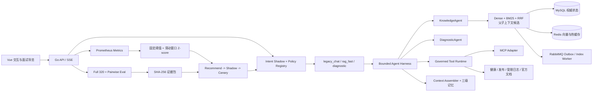

# GopherAI DevSupport

GopherAI DevSupport 是一个面向研发知识问答与故障诊断的 Go Agent 系统。它不是通用聊天机器人，也不以堆叠 Agent、Skill 或 MCP 数量为目标；当前主场景是把项目文档、运行事实、只读工具和历史故障组织为可引用、可恢复、可评测的诊断链路。

在线演示：<http://101.200.145.78:8080/ai-chat>

## 为什么做这个场景

一次真实故障排查通常同时需要回答四个问题：用户到底想查知识还是诊断故障、结论依据来自哪里、Agent 调用了什么以及是否越权、策略变化是否真的带来质量收益。这个项目用一条纵向链路承接这些问题：

1. 多策略意图识别在 Shadow 中给出候选意图，不直接改变正式流量。
2. RAG 对项目文档做结构化解析、版本化索引、混合检索和引用校验。
3. Diagnostic Harness 用有界计划、Checkpoint、暂停/恢复和最多两个 Agent 组织复杂诊断。
4. Tool Runtime 只开放受治理的研发工具，执行前校验 Schema、权限、预算、幂等和循环终止。
5. Working / Episodic / Profile 三级记忆分别承接当前上下文、已确认故障案例和稳定环境事实。
6. Prometheus、阈值与滑动窗口 Z-score 形成监控信号；控制器先 Recommend-only，再经过 Shadow、Canary、人工门和回滚约束。
7. Full 320 数据目录、成对比较、置信区间和版本化证据包约束“效果提升”的表述。

## 架构



### 存储分工

| 组件 | 权威职责 | 明确不承担 |
|---|---|---|
| MySQL | 文档版本、索引任务、Agent Run/Step/Checkpoint、反馈与策略审计 | 不充当高频临时上下文缓存 |
| Redis | 向量检索、活跃 Run 缓存、短期幂等与限流辅助 | 不作为 Run、策略或反馈的唯一事实源 |
| RabbitMQ | Outbox 驱动的异步索引任务与失败重试 | 不保存最终业务状态 |
| 文件化证据 | 评测报告、Release Manifest、严格 Hash 链 | 不替代线上业务数据库 |

## 3～5 分钟演示

登录后点击顶部 `🎤 面试导览`。页面一次只展示一个步骤，避免工程工作台过长：

1. **场景与安全切流**：查看实际路由与 Intent Shadow 分离，说明 Shadow 只观测、不切流。
2. **有依据的 RAG**：打开证据检索，演示结构化引用、版本别名、ACL 和证据不足拒答。
3. **有界多 Agent**：在策略演算中先规划，再运行协作 Shadow；最多两个 Agent，失败时显式降级。
4. **工具与记忆治理**：查看工具契约、预算、只读边界，以及 Working/Episodic/Profile 的职责划分。
5. **评测与反馈闭环**：查看 Full 320、检测器、Recommend-only 控制器、Harness 候选拒绝和证据包。

完整中文讲稿与高频追问见 [docs/INTERVIEW-DEMO.zh-CN.md](docs/INTERVIEW-DEMO.zh-CN.md)。

## 当前可验证事实

以下数字由线上只读接口和 SHA-256 证据包生成，README 不把规格目标写成实测：

- Full 320 数据目录可校验为 `320/320`，六个切片均有固定数量、Schema 与文件 Hash。
- 当前面试证据包为 v4；12 个 Claim 中 8 个达到各自的技术证据门，所有来源先做版本与 Hash 校验。
- 清理审计为 11 个条目全部终态：9 个物理删除、2 个运行边界保留、0 个待删除、0 个阻断；退役入口 24 小时调用为 0。
- Harness 自动候选在公平预算比较中表现为负收益，已被离线、人工与隔离 Shadow 门拒绝，生产活动 Pointer 为 0。这是“门禁有效”的负向证据，不是自进化成功。
- 320 条数据仍未完成人工标签复核，Judge 校准也未满足最终人工门，因此不能宣称最终模型质量提升或完整 R6 发布门已经通过。
- 当前是单 ECS、单应用容器环境；真实百分比生产灰度、数据库收缩迁移与多实例故障切换没有被伪造成已完成能力。

## 主要代码入口

| 能力 | 位置 |
|---|---|
| API 与策略路由 | `router/`、`controller/policy/`、`controller/knowledge/` |
| Agent 生命周期与协作 | `controller/agentrun/`、`controller/policy/` |
| RAG、索引与检索 | `controller/knowledge/`、`cmd/index-worker/` |
| Context 与三级记忆 | `controller/memory/` |
| 工具治理与 MCP Adapter | `controller/toolruntime/`、`common/mcp/` |
| 评测、检测与证据包 | `controller/evaluation/`、`evals/` |
| 前端演示工作台 | `vue-frontend/src/views/AIChat.vue` |
| 云端原子发布 | `scripts/deploy/` |

## 验证与发布

本地用于编译、测试和静态验证；真实运行环境在阿里云 ECS 的 `gopherai2` 容器中。常用技术门：

```powershell
go test -p 1 ./...
go vet ./...
go test -race ./controller/...

Set-Location vue-frontend
npm run lint
npm run build
```

正式发布脚本从 clean Git SHA 生成归档，固定 LF 字节，校验 Full 320 六个切片的数量与 SHA-256，交叉编译三个 Linux 二进制，再通过 SSH 完成版本目录切换、健康检查和失败回滚：

```powershell
.\scripts\deploy\deploy-aliyun.ps1 -RunLocalTests
```

运行拓扑、故障经验和恢复边界见 [scripts/deploy/README.md](scripts/deploy/README.md) 与 [GlobalExperience/2026-09-03-aliyun-ssh-container-deploy.md](GlobalExperience/2026-09-03-aliyun-ssh-container-deploy.md)。

## 设计边界

- 不保存或展示模型隐藏思维链，只记录公开计划、工具消息、证据引用和状态迁移。
- 不开放 Shell、任意 SQL、容器重启或部署等外部写工具；可见副作用必须 HITL、幂等并经 Outbox。
- 多 Agent 不是默认路径，只在复杂度门命中且离线 A/B 证明净收益后才具备切流资格。
- 监控信号不直接修改线上权重；任何自动控制都必须通过最小样本、冷却、迟滞、变更预算、Probe 和回滚门。
- ONNX 图片识别与天气、计算器、时间等演示型能力已退出主场景，避免无业务收益的功能堆叠。
