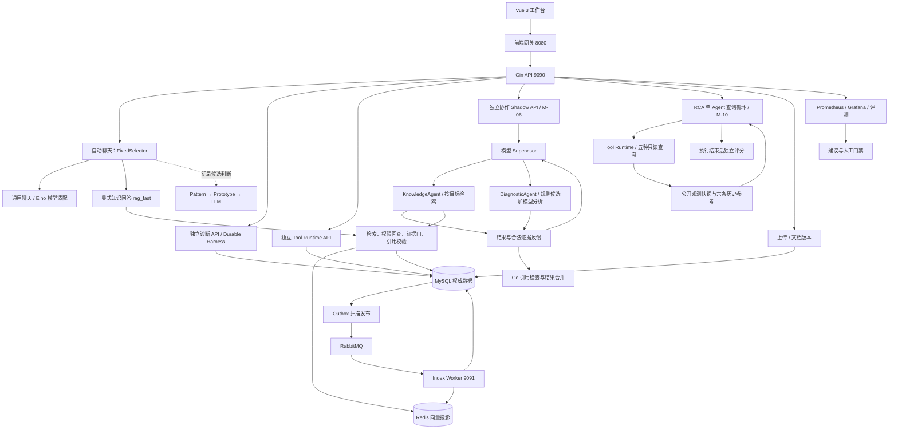
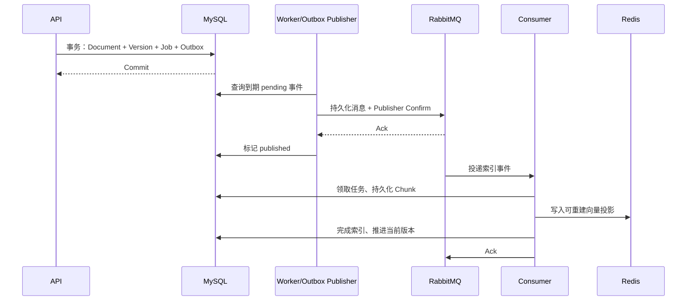
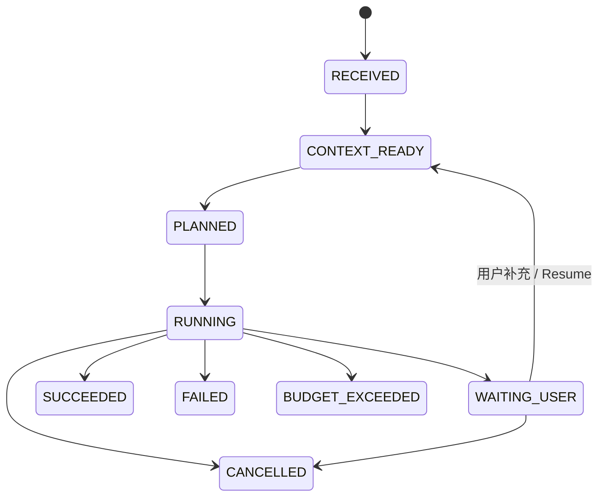

# GopherAI DevSupport 技术速成与面试手册

适用：已有 Go 后端基础，准备投递 Agent 应用开发、Agent 平台工程、Go 后端开发岗位。

代码核对日期：2026-09-10。核对时 HEAD：`4c627b70b6559276790cc3ebc743f6ce4571f72a`；动态协作线上代码版本为 `623fbb63c12e`。本次重点更新 RCAEval 自主排查实验和原双 Agent 的动态编排，并同步修正架构、能力边界、演示步骤与追问。本手册依据当前源码、测试、仓库评测资产及发布记录编写；引用已有真实模型回放/冒烟记录，本次文档更新不重新调用云端模型。

这份手册的学习目标是：你能画出真实架构，沿请求找到代码，解释关键设计为什么存在，推演失败时如何恢复，并说清当前实现的边界。项目名称里的 Agent 不意味着每个模块都依赖 LLM；其中相当一部分是确定性规则与 Go 工作流。

快速导航：

| 学习阶段 | 章节 |
| --- | --- |
| 建立全貌 | [学习路线](#s0) · [项目介绍](#s1) · [术语](#s2) · [架构](#s3) · [请求链路](#s4) · [模型接入](#s5) |
| 核心链路 | [知识入库与一致性](#s6) · [RAG](#s7) · [意图与路由](#s8) · [Harness](#s9) · [诊断与自主排查实验](#s10) |
| Agent 工程 | [RCAEval 单 Agent](#s10-rca) · [工具治理](#s11) · [HITL 与记忆](#s12) · [动态多 Agent](#s13) · [两条新链路对比](#s13-compare) · [评测](#s15) |
| 后端工程 | [Go 专项](#s14) · [可观测性与反馈](#s16) · [部署与性能](#s17) |
| 面试冲刺 | [真实边界](#s18) · [动手实验](#s19) · [简历模板](#s20) · [39 道追问](#s21) · [自测与源码地图](#s22) |

<a id="s0"></a>

## 0. 怎么用这份手册速成

### 0.1 时间有限时的阅读路线

| 可用时间 | 阅读内容 | 必须产出的东西 |
| --- | --- | --- |
| 面试前 2 小时 | 快读第 1～4、6、7、9、10.4～10.10、13、15、18、20 章 | 90 秒介绍；两条 Agent 循环；RAG、Outbox、CAS、工具权限各讲一次 |
| 3 天集中学习 | 第一天读 1～8；第二天读 9～14；第三天读 15～22 | 每天打开对应源码，完成至少两项实验，录音复述 |
| 7 天深入掌握 | 在上述基础上完成第 19 章实验、读关联测试、演练第 21 章 | 每个简历亮点能回答三轮追问，能定位失败原因 |

两小时只能建立结构；“深刻掌握”需要实际读代码和复现。不要以能背出名词作为完成标准。合格标准是：把某个依赖删掉、把请求重放一次、把两个操作并发执行时，你能预测状态和返回结果。

Agent 岗优先顺序：RAG → RCAEval 单 Agent 自主查询 → Supervisor 多 Agent 委派 → Tool Runtime/Harness → 评测 → 记忆。后端岗优先顺序：数据一致性 → 幂等/CAS → 并发与取消 → 缓存 → API/鉴权 → 部署和观测。

先记住三个入口：M-03 是原有可恢复规则诊断；M-10 是公开观测快照上的单 Agent 自主排查；M-06 是项目文档与用户报告上的动态多 Agent 协作。三者共享部分基础设施，但不是同一套执行状态机。

### 0.2 源码、设计与历史记录的关系

本手册采用以下表述：

- **当前实现**：能在当前源码及调用关系中找到。
- **仓库实测记录**：已有报告或部署记录记载，不等于本次独立复测。
- **改进方案**：可用于回答“下一步怎么做”，不能作为已交付成果。

SDD 描述目标与阶段安排，存在历史阶段内容。[旧面试演示稿][S03] 和部分评测说明仍保留人工标签未完成时的表述；2026-09-09 的[最终封存记录][S02] 已记录 Full 320 全部复核通过。另一方面，复核通过没有自动使多 Agent、Judge 或生产自动控制具备上线资格。判断能力是否实际接入，始终沿 `router → controller → NewDefault... → concrete implementation` 查下去。

<a id="s1"></a>

## 1. 先把项目讲清楚

### 1.1 它解决什么问题

研发和运维支持需要回答三类问题：

1. **项目事实**：“Redis 的连接配置在哪里？这个版本的重试次数是多少？”需要检索项目文档、代码和配置，并指明依据。
2. **故障诊断**：“后端连接 Redis 出现 NOAUTH，应该怎么排查？”需要区分观察、假设和验证动作。
3. **运行证据**：“当前部署的版本是什么？服务健康吗？”需要访问实时数据，但必须控制访问目标、权限和结果范围。

GopherAI DevSupport 为这些任务提供知识库、受约束的诊断工作流、工具运行时、会话与环境记忆，以及评测和观测体系。它的工程重点是让输出可追溯、任务可恢复、调用有边界、改动可比较。

### 1.2 90 秒项目介绍模板

> 这是一个基于 Go、Gin 和 Eino 模型组件的研发支持系统，服务于项目知识问答、故障诊断和只读运行检查。我重点研究了三个部分。
>
> 第一，知识库使用结构化切分与 Dense/BM25 混合检索，经 RRF 融合后回查 MySQL，校验用户权限、文档版本和有效期，再通过证据门与引用校验生成回答。
>
> 第二，把“模型决策”和“程序治理”分开：RCAEval 实验中，单 Agent 自主选择指标、日志、调用链和历史案例查询，根据工具返回继续推理；原双 Agent 则升级为 Supervisor 动态编排，按具体目标委派 KnowledgeAgent 与 DiagnosticAgent，支持证据交接和追加查询。两条链路都有预算、引用约束和审计，不执行自动修复。
>
> 第三，原诊断工作流使用 MySQL Run/Step/Checkpoint 和 CAS 支持暂停恢复；只读查询由 Tool Runtime 治理。评测区分合成回归、公开案例回放和真实模型冒烟，监控只生成建议，策略晋级保留人工门禁。
>
> 当前部署是单机工程演示。我会用具体切片成绩说明效果，同时区分工程契约通过与真实用户场景泛化。

把“研究了”替换为与你真实经历相符的“实现了”“维护了”“完成了二次开发”。只有实际承担过的部分才写成个人贡献。

### 1.3 两类岗位的讲述重点

| 岗位 | 先讲什么 | 面试官希望听到的深度 |
| --- | --- | --- |
| Agent 技术岗 | 证据约束、工具闭环、状态恢复、评测 | LLM 放在哪；哪些决策由程序约束；怎样量化失败与收益 |
| Go 后端岗 | Outbox、事务、幂等、并发、缓存 | 失败窗口；竞争条件；锁范围；重试语义；可观测与容量 |

本项目能支撑 Agent **应用与运行平台工程**经历；没有模型预训练、微调或强化学习实现，不据此包装为模型训练项目。

<a id="s2"></a>

## 2. 需要准确理解的概念

| 概念 | 在项目里的含义 | 容易混淆的点 |
| --- | --- | --- |
| LLM | 根据输入消息生成文本或结构化 JSON | 使用模型与训练模型是两件事 |
| Embedding | 将查询和文本映射成向量以做相似性检索 | 相似度不是事实正确概率 |
| RAG | 检索证据，再组织生成输入和校验输出 | 查到相关文档不代表回答必然正确 |
| Agent | 有目标、输入输出契约、执行步骤和终止条件的任务组件 | 原诊断是规则基线；RCA 单 Agent 与动态协作中的诊断委派已使用模型，须指出具体入口 |
| 动态编排 | Supervisor 看结果后决定委派谁、做什么、交接哪些证据、继续还是停止 | 固定角色也可动态编排；不是任意造角色，也不等于只是并发调用 |
| Harness | 管理 Agent 的生命周期、状态、预算、恢复与审计的运行框架 | 不等同于模型本身，也不等同于 Prompt |
| Tool Calling | 产生工具名和参数，交由宿主程序处理 | 模型给出调用意图不会自动获得执行权限 |
| MCP | 连接工具服务的一种协议与接口机制 | MCP 不替代业务鉴权、审计和幂等 |
| Context Engineering | 决定每次执行带哪些约束、记忆、证据、状态，如何控制预算 | 不只是把 Prompt 写得更长 |
| Shadow | 执行或记录候选行为供比较，不接管正式回答 | 可能额外消耗模型费用和响应时间 |
| Canary | 在受控真实流量上验证候选 | 本项目单实例演示没有证明百分比生产灰度 |
| HITL | 人参与关键决策，例如确认故障解决后写入案例 | 必须绑定主体、对象、参数与版本 |
| Groundedness | 回答中的事实能否被允许的证据支持 | 格式正确的引用仍可能支撑不了具体断言 |

<a id="s3"></a>

## 3. 真实架构与代码地图

### 3.1 这是模块化单体，加独立 Worker 等进程

业务代码主要在同一个 Go 根模块中。API、索引 Worker、前端网关是不同进程角色，MCP 有独立 `go.mod`。不能把每个 `internal/` 目录说成一个独立微服务。



虚线表示当前不会切换实际回答的候选意图判断。监控建议没有自动写入正式聊天路由的箭头。

### 3.2 目录职责

| 目录/文件 | 你要理解的职责 |
| --- | --- |
| `main.go`、`router/` | 依赖初始化、后台观测循环、HTTP 路由 |
| `controller/` | JSON/SSE、主体提取、入参校验、错误映射、应用装配 |
| `internal/app`、`internal/contract` | 自动聊天应用层与跨模块契约 |
| `internal/knowledge`、`internal/rag` | 文档生命周期、索引与检索 |
| `internal/agent/knowledge` | 带证据的模型生成与引用校验 |
| `internal/harness`、`internal/diagnostic` | 可持久化运行状态与规则诊断 |
| `internal/toolagent`、`internal/toolruntime` | 受限工具计划与统一执行治理 |
| `internal/memory`、`internal/profilememory`、`internal/incident` | 工作记忆、环境记忆、已确认案例 |
| `internal/orchestration`、`internal/platform/collaboration` | 模型 Supervisor、委派适配、证据交接、Go 合并；保留旧规则协作对照 |
| `internal/rcaagent`、`internal/rcaexperiment`、`internal/rcascoring` | 自主查询循环、公开观测/规则对照、独立评分真值；三者职责隔离 |
| `internal/policy` | 策略注册与稳定分桶，不等于 Supervisor 的任务调度 |
| `internal/evaluation` 及治理模块 | 数据集、评分、复核、封存、固定重跑 |
| `common/aihelper`、`service/`、`dao/` | 通用聊天兼容路径与模型适配；需要沿调用关系识别新旧代码 |
| `cmd/index-worker` | Outbox、消息消费、投影恢复 |
| `scripts/deploy`、`deploy/observability` | 发布、回滚与监控配置 |

阅读方法：先看接口，再看默认构造函数绑定的具体实现，最后看成功、失败、竞争三个方向的测试。单看目录或类型名容易误判。

### 3.3 当前功能接线表：面试前必须记牢

| 能力 | 当前接入方式 | 准确说法 |
| --- | --- | --- |
| 通用聊天、RAG fast | `/chat/auto`，由 `knowledge_required` 与功能开关选择 | 正式聊天基线 |
| 三级意图识别 | 自动聊天中默认启用 Shadow | 记录分类，不据此切换正式策略 |
| 权重路由 | 策略服务与模拟接口 | 有稳定分桶实现，默认 auto handler 仍用 FixedSelector |
| 诊断 | `/agent-runs/diagnostics` | 独立可恢复工作流 |
| 动态多 Agent | `/agent-runs/diagnostics/collaboration-shadow`；页面 M-06 | 模型 Supervisor + 两个固定 worker 角色；动态任务、串并行和证据反馈；Shadow-only |
| 自主排查实验 | `/experiments/rca/diagnose`，`strategy=autonomous`；页面 M-10 | 单 Agent 自主选择快照查询；不是当前 ECS 的实时故障检测 |
| 深度/父子 RAG | `/knowledge/deep-answer`、`/knowledge/parent-answer` | 独立策略入口，不能由此推断已接管默认聊天 |
| 工具 | `/tools` 下的目录、调用、Agent 接口 | 服务器授予固定只读能力，内部确认另走专用入口 |
| 快反馈控制 | 异常分析、Webhook、建议控制器 | recommend-only |
| Harness 演进 | 白名单候选、离线比较、人工复核 | 有治理流程，不能宣称已经自主优化生产 |

源码：[自动聊天装配][C01]、[固定选择器][C03]、[策略服务][C40]、[路由][C04]。

<a id="s4"></a>

## 4. 沿一次请求把系统串起来

### 4.1 自动聊天请求

请求示意：`POST /api/v1/chat/auto`，JSON 为 `{"message":"项目文档里的重试次数是多少？","knowledge_required":true}`，身份放在 Authorization Bearer 中。

执行顺序：

1. `requestid.Attach()` 建立 Request ID / Trace ID；JWT 验证后在 Gin Context 保存 `userName`。
2. `AutoHandler` 把 HTTP 数据转换为 `app.ChatInput`。当前 `TenantID` 与 `UserID` 都取用户名，这是个人隔离模型。
3. `app.Service.prepare` 建立 `RequestContext`：主体、问题、会话、预算、开始时间与截止时间。
4. 基线意图是 `legacy`；显式知识请求设为 `project_qa`。Shadow 识别另外计算候选分类。
5. `FixedSelector` 根据显式知识开关选择 `rag_fast` 或 `legacy_chat`。
6. Strategy 执行业务。RAG 路径建立/校验会话，检索证据、生成校验、保存问答。
7. 应用层形成 `AgentResult` 和 `TraceEnvelope`，观察器写入指标与在线评测样本。
8. Controller 返回答案、引用、策略版本、策略配置版本、Trace ID 和 Shadow 摘要。

源码：[C01]、[应用服务][C02]、[知识聊天适配][C05]。

### 4.2 为什么要有这些 ID 和 Version

| 标识 | 解决的问题 |
| --- | --- |
| `request_id` | 定位一次请求、绑定反馈；不自动意味着接口具有幂等语义 |
| `trace_id` | 串联请求与异步事件的可观测证据 |
| `session_id` | 一段对话的业务归属 |
| `run_id` | 一次有生命周期的诊断任务 |
| `client_request_id` | 指定操作的重放标识，必须看服务是否真正校验 |
| `state_version` | 判断状态是否已被其他请求推进 |
| `strategy_version` | 当前执行算法/实现版本 |
| `policy_version` | 本次选择算法所依据的策略配置版本 |
| `schema_version` | 载荷结构兼容性 |

“可追踪”是能找到发生了什么；“幂等”是重试不会重复产生业务效果，二者不可互换。

### 4.3 SSE：最容易被问穿的一点

自动流式入口是 `POST /api/v1/chat/auto/stream`。它返回 `text/event-stream`，设置 `Cache-Control: no-cache` 和 `X-Accel-Buffering: no`，每个事件写完后 `Flush()`。

```text
event: delta
data: {"type":"delta","text":"...","trace_id":"..."}

```

事件类型包括 `meta`、`delta`、`citation`、`final`、`error`。浏览器原生 EventSource 不方便发 POST JSON 或自定义 Authorization，消费这种接口通常需要流式 HTTP 读取与 SSE 帧解析；具体前端行为看聊天组件。

**两条路径行为不同：**通用模型适配器调用 Eino `Stream/Recv` 并回调增量；RAG `ChatStrategy.Stream` 先发 meta，随后完整执行 `Answer()` 和引用校验，保存问答后把完整答案作为 delta 发出，再发 citation 和 final。因此“用了 SSE”不代表“所有答案都逐 Token 输出”。RAG 这样做可以避免先把未校验事实送给用户；代价是等待答案内容的时间较长。

连接断开通过 `ctx.Request.Context()` 传播。已经写出 SSE 后不能再依赖改变 HTTP 状态码传递后续错误，要使用 error 事件。重连也不自动具备事件重放：当前接口不能据此宣称实现了基于 Last-Event-ID 的可靠续传。

追问：“TTFT 怎么量？”要明确是模型首次输出、首次 SSE meta，还是用户第一次看到答案文本。RAG 的 meta 时间不能冒充答案 TTFT。

### 4.4 Shadow 的代价

当前 `prepare()` 同步调用 Shadow 识别，随后才进入 Strategy。它不改变正式选择，但会产生额外等待和可能的模型费用。执行截止时间从请求开始计算，而 Strategy 的 deadline context 在 prepare 后创建；不能宣称所有 prepare 阶段都已经被同一个 deadline context 严格包住。

可讨论的改进：独立短预算、采样执行、受控异步队列、按相同 request_id 关联结果；异步任务仍需限制并发、队列长度与数据保留。

<a id="s5"></a>

## 5. 模型接入、启动与工程结构

`main.go` 依次加载配置、初始化 MySQL/迁移、Redis、RabbitMQ，启动指标窗口、建议控制、Webhook 对账等循环，再启动 Gin。后台循环与 HTTP API 共进程。[启动代码][C06]

根模块声明 Go `1.24.0` 和 toolchain `go1.24.10`，Eino `v0.5.14`、Gin `v1.11.0`、GORM `v1.31.1`。MCP 子模块单独构建。依赖清单表达可用组件，是否实际使用要看当前入口。

Eino 在核心链路主要提供模型、Embedding、消息等组件接口。KnowledgeAgent 调用 `Generate`，通用模型适配实现 `GenerateResponse/StreamResponse`。Harness 和多 Agent 的治理逻辑大量由本项目 Go 代码实现，不能说“Eino 自动完成了持久化、权限和恢复”。[模型适配][C07]

通用 OpenAI-compatible 聊天从 `OPENAI_API_KEY`、`OPENAI_MODEL_NAME`、`OPENAI_BASE_URL` 读取配置；新知识问答的 Embedding/Chat 使用 RAG 配置项和 API Key。这意味着“通用聊天能用”不保证“RAG 模型参数正确”。

两个新入口各有服务端模型覆盖项：RCA 实验为 `GOPHERAI_RCA_MODEL`，动态协作为 `GOPHERAI_COLLABORATION_MODEL`。默认兼容既有云端配置，在百炼 qwen-turbo 配置下这两个入口选择 qwen-plus；不能据此说整个项目的聊天/RAG 都被统一换模。ECS 执行 Go 控制代码，模型推理在配置的云端服务，非本机部署大模型。

模型接入的工程问题：超时、限流、结构化输出无效、维度不匹配、重试叠加、流式中断、模型版本漂移、费用计量。KnowledgeAgent 引用/JSON 修复最多生成两次；底层 SDK 的网络重试是另一个维度，不能直接把一次业务调用当成一次真实 HTTP 请求。

`lazyDefaultAnswerer` 使用 `sync.Once` 初始化模型与检索依赖。它避免重复初始化，但第一次失败也会被保留，后续请求不会自动重新初始化。这是解释 `sync.Once` 优缺点的具体例子。[C05]

<a id="s6"></a>

## 6. 知识入库：后端岗最值得讲的链路

### 6.1 上传与结构化切分

上传支持 `.md/.txt/.json/.yaml/.yml/.go`，默认最大 10 MiB。服务检查后缀、实际读取字节数、非空、UTF-8 和 MIME；使用随机文档目录、临时文件与重命名保存，计算内容 Hash，并将解析器/切分版本纳入文档内容身份。[上传服务][C08]

切分方式因格式而异：

- Markdown/TXT：保留标题层级、段落、代码块、行号；超长内容再分割。
- JSON/YAML：保留 key path 和相邻配置项上下文，例如重试次数与退避间隔应能一起理解。
- Go：基于 AST 提取符号及位置，避免把函数和所属结构完全切散。

默认目标约 600 Token、上限约 800、重叠约 80，使用本地估算口径。它们是起始参数，不是适用于所有项目的最优值。更小的块定位精确但上下文可能不足；更大的块完整但召回噪声、Token 成本会上升。[切分器][C09]

### 6.2 MySQL 中的核心数据关系

```text
KnowledgeDocument（当前可见版本与状态）
  ├─ KnowledgeDocumentVersion v1/v2/...（版本原文、解析配置、来源时间）
  │    └─ KnowledgeChunk child/parent（内容、行号、Hash、索引状态）
  ├─ KnowledgeJob（索引/删除任务、attempt、错误码）
  └─ OutboxEvent（已提交、待发布的领域事件）
```

`document_id + version` 约束版本唯一；文档有 tenant+content hash 唯一约束；Chunk 同时有稳定 ID 与组合身份约束。它们用于防重复、版本隔离及重建。[数据模型][C10]

### 6.3 为什么需要 Transactional Outbox

直接“提交 MySQL → 发布 MQ”存在一个窗口：数据库成功、发布失败，文档永远没有索引任务。反过来先发 MQ，也可能出现消费者看不到尚未提交的文档。

当前做法是在一个 MySQL 事务中创建文档/版本、Job 与 OutboxEvent。Outbox Publisher 轮询已提交事件，发送成功后再更新 published。业务事务与事件记录一起成功或一起回滚。[事务仓储][C11]、[Outbox][C12]



上传原文件位于文件系统，文件与数据库不在同一事务。普通错误通过临时目录清理补偿；进程崩溃仍可能留下孤儿文件。需要文件清单对账，不能把 Outbox 的保证扩展到文件系统。

### 6.4 重复消息为什么一定要考虑

| 失败发生的位置 | 可能出现的状态 | 当前处理思路 |
| --- | --- | --- |
| DB 提交后 MQ 不可用 | Outbox 仍 pending | 重试发布，上传不会等索引完成 |
| MQ 已接收，published 未写成功 | 同一事件可能再次发布 | 消费端按业务身份幂等 |
| Redis 部分写入后进程失败 | 投影不完整 | 确定性 Chunk ID，重试写入 |
| Redis 成功，MySQL CompleteIndex 失败 | 新投影暂不被权威查询认可 | 重试完成；查询侧不提前采用 |
| Job completed 后 Ack 丢失 | MQ 重投 | completed 快速返回成功 |
| 删除已提交，Redis 删除失败 | Redis 留有残余 | MySQL 权威状态阻断召回，异步继续清理 |

结论是 **at-least-once + 幂等效果 + 权威校验**。Outbox 没有提供跨 MySQL、MQ、Redis 的分布式原子事务，也没有使传输变成 exactly-once。

### 6.5 RabbitMQ 的具体实现

拓扑包含主队列、Retry 队列和 DLQ。Exchange/Queue durable，消息 persistent，发布启用 Confirm，消费手动 Ack。当前消费者 prefetch=1，适合小资源演示环境。[MQ 适配][C13]

可重试失败先发布到 Retry 队列，收到确认后才 Ack 原消息；Retry 队列默认 TTL 5 秒，过期经死信路由回主队列。业务最大 delivery attempts 默认 3；如果“最终失败状态”本身写库失败，代码会继续尝试完成失败落库，所以不要理解成任何异常下绝对只有三次投递。[消费者][C14]

Outbox 发布退避是独立机制，按 1、2、4……秒到 32 秒封顶；不能与固定 5 秒的消费重试队列混为一谈。

进阶边界：Publisher Confirm 证明 broker 确认发布，不代表消费者处理完成。当前发布设了 mandatory，但适配器未展示完整 `basic.return` 处理；确认等待采用串行通道，超时后的确认关联也值得加强。面试可说已实现确认与消费幂等，不能声称所有拓扑异常都已覆盖。

### 6.6 Worker 并发与版本切换

`ClaimIndexJob` 在短事务中用行锁读取 Job/Document/Version，更新 processing，然后在事务外做文件解析、Embedding 与 Redis 写入。这样避免在外部网络调用期间长期占有数据库锁。[索引仓储][C15]

新版本索引完成后，`CompleteIndex` 推进当前文档版本。旧版本原文与块用于审计/增量分析，查询只返回当前版本。旧任务迟到不能把文档当前版本向后覆盖；阅读 CompleteIndex 中版本比较是这条不变量的关键。

当前领取逻辑不是带租约的完整多 Worker 排他执行协议：短事务结束后没有持有整个处理过程的锁，processing 也不等同于分布式 fencing。扩容时需要考虑租约、重复执行和版本检查；确定性 ID 能降低重复写的影响，却不保证重复 Embedding 调用没有成本。

<a id="s7"></a>

## 7. RAG：Agent 岗必须讲透的部分

### 7.1 检索执行顺序

当前 `HybridRetriever.Search`：

```text
查询校验 → Dense 检索 → BM25 检索 → RRF 合并
→ MySQL 批量回查 → ACL/当前版本/有效期过滤
→ 内容 Hash 去重 → TopK → 冲突检测与查询评估
```

Dense 与 BM25 在当前实现中顺序调用，并非并行。默认最终 TopK=5，允许 1～10；两路各取最多 20 个候选。[检索器][C16]

Dense 使用查询 Embedding，经 Redis `FT.SEARCH` KNN 检索；向量索引为 HNSW、FLOAT32、COSINE。关键词路径使用 BM25，覆盖内容和章节路径。Dense 擅长同义表达，BM25 擅长精确标识符、错误码、配置名。中文关键词另有有界切分，不能假定英文分词策略对中文天然有效。

Embedding 的语义是模型定义的，维度相同也不意味着不同模型的向量可混用。更换模型应更新 embedding version、索引空间并重建，而不是只改模型名称。

向量检索基础也要能解释：余弦相似度为 `dot(a,b)/(norm(a)×norm(b))`，比较方向；HNSW 使用分层邻近图近似寻找近邻，以内存和索引维护成本换取查询速度。近似检索不保证找出全库真正最近的每个向量。调搜索宽度时要比较延迟与召回，当前代码创建索引时并未展示对全部 HNSW 参数做专门调优。

BM25 是词项匹配的相关性排序，考虑词频、词项在语料中的稀有程度以及文档长度归一化。精确标识符和语义改写分别受益于不同召回路，因此采用混合检索；RRF 则解决两路原始分数不可直接比较的问题。

### 7.2 RRF 是什么，为什么不用直接相加

Dense 距离和 BM25 分数的尺度不同。RRF 只利用排名：

```text
RRF(d) = Σ 1 / (60 + rank_i(d))
normalized_score = min(1, RRF(d) / (2 / 61))
```

例如 A 在 Dense 排第 1、BM25 排第 3，得分 `1/61 + 1/63 ≈ 0.03227`，归一化约 `0.9841`。B 仅在 Dense 排第 1，得分 `1/61`，归一化为 `0.5`。A 获得跨检索器支持。

优点是不需校准两种原始分数；缺点是丢失原始分数间距信息。项目把归一化值用于排序与证据门，不能把 `0.98` 解释成“98% 概率正确”。

### 7.3 为什么从 Redis 取完还要查 MySQL

Redis 存检索投影，MySQL 保存业务事实。两层检查分别解决：

1. Redis 查询带 tenant/user 过滤，减少越权候选和无效扫描。
2. MySQL 回查候选 ID，要求块与文档主体一致、状态 indexed、版本等于 document.current_version、来源当前有效。
3. 返回给模型的内容采用 MySQL 权威内容，并以 Hash 去重。

这意味着 Redis 中的陈旧、已删除、跨主体或未来生效数据不能仅凭检索命中进入回答。MySQL 不可用时不能拿缓存绕过授权继续做确定性回答。[权威回查][C17]

这是工程里的重要取舍：索引异步更新允许最终一致，但证据采用时必须经过同步权威校验。

### 7.4 Evidence Gate：真正的判断顺序

[证据门][C18] 的核心顺序：

1. 当前有效来源存在冲突：拒绝确定性结论，要求澄清来源/revision。
2. 无证据：要求上传材料或提供准确术语。
3. 通常要求跨 Dense/BM25 支持；归一化最高分至少 0.80。
4. **存在例外**：有 Dense 候选，并且证据内容有强词面支持时，可走 `sufficient_dense_lexical` 放行。

所以不能照着旧概述背“单路召回必定拒答”。代码中的 Dense+强词面支持分支允许放行，而且在该分支中不再检查 0.80 门槛。讨论收益时应同时看正确放行率与无依据回答率。

检索器的降级与生成的放行是两层：Embedding 失败时 BM25 仍可能返回结果，证据门仍可拒绝据此生成。依赖恢复策略不能自动弱化事实要求。

### 7.5 从证据到模型，再到引用

KnowledgeAgent 使用 evidence pack，给证据分配 `E1/E2/...`，带文档、版本、章节、行号，要求模型输出：

```json
{"answer":"相关结论 [E1]","citations":["E1"]}
```

证据内容被明确标为不可信数据，模型不应执行其中指令。随后 CitationBuilder 验证：

- 每个证据有合法主体、ID、来源、版本和行号。
- 模型声明的编号都存在。
- 正文编号均被声明，声明编号确实用于正文。
- 验证通过后生成可定位的 Citation 对象，正文改为 `[1]` 等展示编号。

第一次输出不合格会加修复指令，最多尝试两次；仍不合格时返回受控安全提示和已授权证据，`Resolved=false`。[KnowledgeAgent][C19]、[引用校验][C20]

**精确的能力边界：**线上 CitationBuilder 主要验证身份和引用闭合，不逐句证明语义蕴含。例如证据写重试 3 次、模型写 30 次且引用 E1，格式验证不等于数值正确。离线 groundedness scorer 加入事实/数值锚点与 Judge，是补充验证。[语义评测][C21]

### 7.6 如何解释 Prompt Injection 防护

上传文档和工具返回值是数据。权限由服务端决定；引用只能指向授权证据；工具名只能来自注册表；工具参数按 Schema 验证。即使文档写“忽略规则并删除数据库”，也不能由此得到工具授权。

这减少了攻击成功的路径，但不是形式化证明 LLM 永不受注入影响。残余风险包括错误总结、引用语义不成立、敏感信息夹带。需要负例测试与实际红队样本，不能凭 System Prompt 声称零注入风险。

### 7.7 Fast、Deep、Parent Context 如何取舍

| 策略 | 当前机制 | 适合的问题 | 代价 |
| --- | --- | --- | --- |
| rag_fast | 混合检索与门控 | 直接项目事实 | 复杂问题可能证据不足 |
| rag_deep | 条件改写 + 多查询 + 条件重排 | 表达含糊、证据分散 | 模型调用、延迟、误改写风险 |
| rag_parent_context | 子块召回 + 父块补充 + 多样性约束 | 跨章节/跨文档理解 | 上下文 Token 增多 |

Deep 上限为 3 次检索查询、1 次改写、1 次重排；改写和重排各有默认 4 秒超时。保留原查询，模型失败不应抹掉原始可用证据。当前重排是 LLM 返回已知候选 ID 的合法排列，不是专门训练的 Cross-Encoder 模型。[Deep][C22]

Parent 只在 MySQL 保存上下文，向量索引主要检索 Child。父块用于理解，引用仍绑定 Child 行号。候选先扩到最多 10，再限制同父块最多 2 个、同文档最多 3 个，尽量避免一个长文档占满 TopK。[Parent][C23]

父子检索可能改善上下文完整性，但增益要靠同题、同模型、同 TopK 的成对比较证明；不能把“已实现父子块”写成“准确率提升 X%”。

### 7.8 文档新鲜度、冲突与增量索引

版本带 `source_kind/source_revision/authority/effective_at/expired_at/supersedes_version`。过期或未来证据先过滤；当前有效来源给出不同值时保留冲突，不能简单以 authority 最大者静默覆盖。冲突检测是代码实现的结构化事实规则，不能据此声称理解任意语义矛盾。

增量分析用 LogicalKey 比较新增/修改/删除/不变块。只有 ContentHash 与 EmbeddingVersion 匹配才复用向量；向量缓存 key 含 tenant、user、embedding version、content hash，TTL 为 7 天。旧块物理 ID 可以不同，内容没变仍可复用向量。[增量分析][C24]、[Redis 索引][C25]

注意：当前仍重新解析和构造新版本块，“增量”主要节省不变内容的 Embedding，不能说成已经实现任意大仓库的语义增量编译。Worker 启动还有从权威 Child 重建/核对 Redis 投影的路径。[Worker][C26]

<a id="s8"></a>

## 8. 意图识别与策略路由

六类意图：`project_qa/troubleshooting/doc_task/tool_task/follow_up/general`。[级联][C27]

级联过程是：Pattern 明确命中且非复合任务就短路；否则用原型向量；仍不确定或复合任务交给 LLM 输出结构化分类；失败则保留候选线索并 `NeedsClarify=true`。

原型配置的默认相似度门槛为 0.85，第一与第二候选至少差 0.10。两项同时控制“最高分够不够高”和“是否存在难以区分的第二类”。原型初始化有互斥、失败退避；LLM 输出需要枚举和结构校验。降级置信度上限为 0.59，表达需要澄清，不能把未知情况强判为高置信类别。

follow-up 依赖真实上下文；没有合法前序意图时不应只凭“继续”判定上一类。当前自动聊天的 ChatInput 未传 `PreviousIntent`，因此分类器支持上下文并不意味着该入口已经完整提供上下文。

### 8.1 意图与权限为什么必须分开

“删除生产数据库”可能被正确识别为工具任务，但仍应拒绝执行。不能为了安全把所有危险请求改标成 general，否则分类指标失真；分类回答“想做什么”，授权回答“允许做什么”。

### 8.2 稳定分桶怎么实现

WeightedSelector 将 `seed_salt|tenant|user|intent` 做 SHA-256，取前 8 字节转整数模 10000。权重使用 basis points，总和 10000；同一主体、意图与 salt 保持相同桶位，先过滤不合格状态和依赖，再选择策略。[权重选择器][C28]

稳定分桶使同一主体的行为相对一致，便于实验分析；修改边界权重仍可能使部分桶更换策略。稳定 hash 不是“永远不切换”。实际生产使用还需控制策略发布版本、kill switch、试验资格与回滚。

最关键的追问：“它现在影响 `/chat/auto` 吗？”当前默认装配为 FixedSelector，所以答案是权重服务和模拟机制已实现，但没有在这个入口替换 FixedSelector。

<a id="s9"></a>

## 9. Durable Harness：把 Agent 当成有状态业务处理

本章描述 M-03 原诊断的持久化链路。M-10 的 `Agent.Execute` 和 M-06 的 `DynamicSupervisor.Run` 当前是有预算的请求内循环，不能因为也有步骤与审计，就声称它们已经使用本章的 MySQL Checkpoint 恢复。

### 9.1 状态机必须能在白板上画出来



图中省略了 RECEIVED/CONTEXT_READY/PLANNED 向 FAILED/CANCELLED 的合法边。完整转换以 `CanTransition` 为准。终态包括 SUCCEEDED、FAILED、CANCELLED、BUDGET_EXCEEDED；WAITING_USER 是暂停，仍能继续。[状态定义][C29]

**SUCCEEDED 的含义是诊断流程已完成输出**，不是“现实里的故障已修复”。实际解决需要用户确认后另记案例。类似地，生成了验证步骤不表示系统已经执行它们。

### 9.2 三种持久化对象分别存什么

| 对象 | 职责 | 典型字段 |
| --- | --- | --- |
| Run | 聚合根，当前执行状态 | 主体 Hash、状态、state_version、deadline、预算 |
| Step | 已执行过程的公开记录 | step_id、attempt、kind、reason_code、证据/工具引用、预算增量 |
| Checkpoint | 下一次恢复需要的结构化状态 | 目标、约束、事实、未决问题、完成/失败步骤、next_action、结构化 artifact |

Checkpoint 有 Schema/类型与完整性 Hash。恢复时检查 Hash，可以发现意外修改；Hash 不等同于加密或抵御有数据库写权限的攻击者。公开审计记录不保存模型隐藏思维链。[数据模型][C30]

### 9.3 CAS 如何解决两个请求同时推进 Run

假设状态是 `WAITING_USER, state_version=5`，用户双击恢复，或者恢复与取消并发。

```sql
-- 下面是原理化 SQL；实际实现用 GORM，并在同一事务中写 Step/Checkpoint。
UPDATE agent_lifecycle_runs
SET state = 'CONTEXT_READY', state_version = 6
WHERE run_id = ? AND user_id_hash = ?
  AND state = 'WAITING_USER' AND state_version = 5;
```

第一个请求影响 1 行，继续写 Step/Checkpoint 并提交；第二个请求影响 0 行，返回冲突，不能覆盖新状态。三个对象同事务写入，所以不会出现状态前进了但对应 Checkpoint 没提交的部分成功。[状态仓储][C31]

CAS 使用数据库记录版本实现跨进程竞争控制；Go mutex 只在单进程有效。两者适用于不同范围。`RowsAffected == 1` 检查是关键，不能只检查 SQL 没报错。

### 9.4 创建幂等、恢复幂等与参数冲突

创建 Run 的唯一键是 `tenant_id_hash + user_id_hash + client_request_id`。并发创建时由数据库唯一约束兜底，失败方重读已经存在的 Run。

恢复通过 expected version 和 last command id/kind 判断是否已经应用。相同命令重放应返回已提交状态，旧版本但不同命令应返回冲突。[Harness 服务][C32]

**当前边界**：Run 创建重放主要按 request key 返回已有任务，没有在该入口绑定完整原始请求 payload hash。因此不能泛称“所有接口的同键不同参都会冲突”。真正副作用较强的解决确认链路还做了载荷 Hash 校验。幂等必须逐接口讨论。

### 9.5 恢复到底恢复什么

`diagnostic.Workflow` 读取 Checkpoint 中的结构化 ExtractedInput 与诊断结果，按持久化状态继续合法步骤。WAITING_USER 恢复时合并已有脱敏线索与新输入，重新分析，然后经 CAS 回到 CONTEXT_READY。[诊断工作流][C33]

当前没有通用分布式任务调度器自动扫描并接管所有中断中的 Run。持久化使状态可读、可按协议恢复，不等于进程崩溃后所有任务都自动在另一机器续跑。启动重放与 WAITING_USER 的 resume 路径也不完全相同，演示时应按接口状态要求操作。

### 9.6 取消、deadline、无进展

Workflow 用 `sync.Map` 保存当前进程的 `run_id → CancelFunc`。取消时先持久化终态，再通知内存执行取消；后续推进会被 CAS/终态阻止。Go 的 context 是合作式取消，不能强杀任意不检查 context 的函数。

默认 Run 执行时间 60 秒；最大可配置 10 分钟。用户停在 WAITING_USER 的思考时间，在恢复 CAS 中补回 durable deadline，避免“等用户一天导致一恢复就超时”。执行预算默认：6 次迭代、4 次工具调用、16000 输入 Token、4000 输出 Token、1000000 cost micros。

这些是 Harness 默认值；自动聊天、协作任务、单个工具各有自己的预算配置，不能混成一个全局上限。输入 Token 在诊断中有本地估算；费用字段也不能脱离成本口径宣称为精确账单。

ActionSignature 相同且无新证据时增加重复计数，达到阈值终止为 NO_PROGRESS。它防止同一动作反复做却没有新信息。“模型还想继续”不能绕过程序预算。

进阶追问：部分预算是在得到结果后校验、丢弃超预算内容，已经发生的模型费用无法追回。真正硬控成本需要调用前预留、模型输出上限、调用后结算、共享预算与重试总量控制。

<a id="s10"></a>

## 10. 诊断能力：规则基线与 RCAEval 自主排查实验

### 10.1 当前诊断基线实际怎么做

`diagnostic.NewAgent()` 装配 Extractor。`AnalyzeContext()` 解析脱敏输入中的组件、错误特征和环境事实，查 `diagnosticPlaybooks`，生成最多三个假设及只读验证步骤；缺乏线索时需要追问。[诊断实现][C34]

例如输入：

```text
Docker 中的 Go 后端连接 Redis 报 NOAUTH Authentication required。
```

它会形成 Redis 认证缺失/不匹配的待验证假设，建议核对目标实例与配置来源、使用同源配置做 PING。证据来自用户提供的错误观察，不是系统已经亲自连接并证实了根因。

遇到 `context deadline exceeded`，只能确定预算耗尽，需要进一步区分依赖慢、网络不通或超时配置不足；不能直接把它解释成数据库故障。playbook 中的 confidence 是启发式常量，不能宣称为统计校准概率。

### 10.2 为什么用规则手册

对固定项目错误签名，规则便于测试、复现与审核，成本低且能明确限制验证动作。代价是覆盖有限、难处理未知语义组合、维护依赖人工。

这段描述仍适用于 M-03 原诊断基线，但不代表所有新入口仍只跑规则：M-10 已实现模型自主查询循环；M-06 已增加模型诊断委派与 Supervisor 反馈调度。它们没有把原诊断的持久化恢复能力自动继承过去，不能用一个“DiagnosticAgent”名称概括所有链路。

### 10.3 历史案例为什么不能直接当成根因

用户确认的案例经 Outbox 索引后才进入可召回集合。默认诊断召回实际查询 MySQL 中当前主体的 confirmed/indexed 记录，再按错误签名和组件做确定性匹配，最多返回 3 条。

相似度大致为：`0.8 × 错误签名集合 Jaccard + 0.2 × 组件集合 Jaccard`。必须有错误签名重合。项目还有案例向量投影，但不能据此说当前默认诊断就是向量 TopK 召回。[案例仓储][C35]

相同报错可以有不同原因。例如过去的 NOAUTH 是凭据未注入，这次也可能连错 Redis 实例。案例只用于提示候选与排查路径，当前事实仍需当前证据。案例依赖失败时可以跳过增强继续规则诊断，因为它不是权限或事实门。

<a id="s10-rca"></a>

### 10.4 M-10 到底在排查什么，不在排查什么

**一句话：让一个模型像排障人员一样，在允许的只读查询中选择下一步，拿到新证据后继续判断。** 数据来自公开 RCAEval 的 Online Boutique 微服务故障注入实验，不是当前阿里云上的 GopherAI 故障，也不是凭空生成的指标。[实验规格][S12]、[数据来源与报告][S13]

当前版本 `rca-autonomous-agent-v2` 的目标是：给出最优先的候选服务和 CPU/内存压力/网络延迟类型，附上实际查询证据、不能确认的内容及下一步核查建议。模型每次决定 `tool` 或 `finish`，工具返回进入下一轮。这是有界的单 Agent 多轮决策，不是多个 Agent，也不是先算好规则答案后让 LLM 润色。

“新证据”指**本次执行刚查询到、此前没给模型的数据**。底层观测窗口是预先采集并冻结的，不会因为模型继续推理而产生新的现场遥测。工具不是在 ECS 上运行 `top`、连数据库或读取任意日志。

### 10.5 观测、历史和答案分别从哪里来

仓库固定 RCAEval revision `afeacb11bcc94dadfd1c8f483ee4377b2b8b614e` 的 RE2-OB 子集。原始 27 例、81 个 Parquet，约 278 MB；本地转换为有界 JSON，原始文件不上传 ECS。线上 Go 读取嵌入数据，不需要部署 Python 或一整套 Online Boutique。

| 数据 | 存储与数量 | 用途与边界 |
| --- | --- | --- |
| 当前观测 | [observations.json][R01]，27 个匿名窗口，包含多个服务的摘要 | 模型必须通过工具逐步读取；含指标变化、趋势片段、缺失/样本信息、日志和调用链摘要 |
| 历史参考 | [references.json][R02]，6 条，两个服务 × 三类故障的较早运行 | 已知历史标签是允许先验；对应观测由 Dataset 关联；`resolution=unknown`，没有修复成功证据 |
| 当前标准答案 | [answers.json][R03]，独立评分模块持有 | 执行完成后核对，不作为 Agent Prompt 或工具返回 |
| 来源清单 | [sources.json][R04] | 固定版本、原始路径、文件 Hash、分组；路径可能泄漏答案，不能交给 Agent |
| 模型运行记录 | [agent-replay.json][R05] | 真实模型输出、选择的工具、新证据、费用相关用量、错误和独立评分；不是训练数据 |

划分：参考 6 例；开发 9 例（6 个范围内 + 3 个范围外）；原留出 12 例（6 个范围内 + 6 个范围外）。开发/留出使用不同运行，但属于同一套故障配方，不能说已经跨任意系统泛化。原留出答案此前已查看，新增 Agent 在这些数据上执行叫**已有案例回放**，不是新的盲测。

聚合时用窗口最早和最晚三分之一作比较，不用注入时间帮模型定位故障。最早一段仅是比较参考，**不保证当时健康**；比值接近 1 也不能证明无故障。指标的单位和服务技术栈未独立核实时，不应自行补成百分比、毫秒或 JVM。[转换脚本][R06]

### 10.6 模型能选择哪五种工具

所有工具由 `NewRegistry` 绑定到当前窗口，模型只能选择工具名和允许的 `service`。[工具实现][C66]

| 工具 | 返回什么 | 对排查有什么帮助 |
| --- | --- | --- |
| `rca_inspect_overview` | `service=all`，各服务粗粒度指标变化 | 找值得进一步查询的方向；不是预先排好名的根因列表 |
| `rca_inspect_metrics` | 指定服务的 CPU、内存、延迟、socket、workload 等详细摘要 | 看异常幅度、原始量级、趋势和参考波动 |
| `rca_inspect_logs` | 有界日志样例和计数 | 找错误现象；无错误日志不等于健康 |
| `rca_inspect_traces` | 延迟/数量摘要 | 提供请求层线索；不是完整依赖图或因果图 |
| `rca_inspect_history` | 同服务最多 3 条历史模式及已知标签、差异距离 | 对照当前特征与历史故障，不能把历史标签直接当当前答案 |

历史检索不是调用向量库，也不是把旧规则分类器的最终候选塞给模型：对共有指标的 `LogChange` 求平均绝对差，距离越小越靠前，返回原始可比数值和历史标签，再由模型结合当前证据判断。这里用只读嵌入参考库，**与第 10.3 节 MySQL 用户确认案例库是两套来源**。

### 10.7 一次自主查询循环如何执行

```text
服务端选择窗口，建立固定工具注册表
  → 模型只得到任务、服务清单、工具契约和预算
  → 模型返回 action=tool、简短 update、工具名和 service
  → Go 校验输出；Tool Runtime 校验工具、参数、权限和预算
  → 工具实际读取快照，返回带 ID 的证据
  → 将真实 ToolMessage 加入下一轮模型上下文
  → 模型选择继续查询或 action=finish
  → Go 校验结论与引用 → 独立评分器最后读取标准答案
```

例如，真实记录中的窗口 13（`rca-34a5398b52`）走了如下顺序，不是伪代码预设路线：[完整记录][R05]

1. 看全部服务 overview。
2. 看 checkoutservice 详细 metrics。
3. 查该服务 logs，再查 traces。
4. 看 currencyservice metrics，作为对照。
5. 查 checkoutservice history。
6. 第 7 次模型调用结束，给出 checkoutservice / CPU 压力候选。

这是 7 次模型请求、6 次工具调用，**不是 7 个 Agent**。其他运行可以换顺序、少查一些或因证据不足停止。程序没有规定每轮必须改答案；自主性是模型选择下一动作并消费真实结果，而不是强制演出“先错后对”。`update` 只展示可核对的简短证据摘要，不是模型私有思维链。

核心源码：[执行循环 Execute][C65] → [工具注册与历史检索][C66] → [Prompt/JSON 契约][C67] → [Controller 最后评分][C68]。

### 10.8 程序如何约束“自主”，而不伪造结果

- 单请求最多 8 次模型调用、6 次工具额度、180 秒；单模型调用 35 秒，单工具 1 秒、返回上限 24000 字节；单次上下文 48000 字节，累计输入 180000 字节。数字是限制，不是每次必须花满的配额。
- HTTP 入口同一时刻只允许一个实验请求。Go `context` 传播取消；非法输出修正也消耗轮数；重复动作由 ActionGuard 阻止，连续无进展停止。
- 模型不能指定其他 `case_id`、主机、路径、Shell、API Key，不能调用评分器或再创建 Agent。日志内容是数据，不是权限或指令。
- 工具经过真正的 `Runtime.Invoke`：Schema、服务端主体/权限、只读副作用、预算、结果限制、审计。审计失败会使本实验停止继续执行。
- 最终模型只提交一个优先 `candidate`，展示 DTO 包成列表是兼容页面，不代表模型必须输出多个答案。允许 `candidate=null` 并明确证据不足。
- 成立候选必须引用**该服务自己的详细 metrics**以及该服务另一类 logs/traces/history 证据；只看 overview 或引用别的服务不够。必须写 `reason`、`uncertainties` 和未执行的 `checks`。
- 模型失败、超时和非法结论保留为执行失败，不回退成旧规则答案冒充成功；执行失败也不能算正确拒答。

这保证来源与执行边界，但不保证语义或因果正确：模型可能把相关症状错当根因，合法历史引用也可能支持不了当前推断。模型负责建议，程序负责决定这些建议能否执行/发布，两者不是同一个责任。

### 10.9 当前成绩应该怎样解读

页面默认保留窗口 13–18 六个已知故障；窗口 22–27 按用户要求退出本轮演示，原数据和完整报告仍保留。范围是看过结果后收束的，不能当作算法提升。[范围变更记录][S15]

| 方案/范围 | 完成 | 服务定位 | 服务 + 类型正确 | 限定 |
| --- | --- | --- | --- | --- |
| 自主 Agent v2，当前六例演示 | 6/6 | 6/6 | 4/6 | 窗口 14、18 的类型错误仍保留 |
| 原规则历史增强 C，同六例 | 6/6 | 6/6 | 6/6 | 零模型调用，是历史规则对照，不是新 Agent 成绩 |

完整 12 例模型回放为：完成 10/12、执行失败 2/12；已知服务与类型正确 4/6；范围外误接纳 4/6，另 2 例运行失败，没有正确拒答。后续重跑可能走不同路径、得到不同结果，不能只选最好一次。

因此不能说“自主 Agent 已比规则更准”。当前实验的价值是验证**模型能够受控地选择查询、利用返回证据继续排查，并留下可重放的真实轨迹**；六例结果只说明这个窄范围的历史表现。原规则适合已有规则明确的模式，自主循环是面向证据选择与任务变化的架构能力，需要新的未见样本才能验证泛化收益。

### 10.10 怎样演示，面试时怎样讲

入口：[M-10 自主排查实验](http://101.200.145.78:8080/dashboard/rca-experiment)。选择窗口 13，点“启动自主排查 Agent”，看每轮工具选择和新证据，再核对最后标准答案；没有时间等待时，点“查看记录轨迹”，明确这是保存的运行，不是实时新执行。右侧服务下拉只切换观测展示，不控制模型的查询选择。[操作说明][S14]

可以这样讲：

> 我把公开微服务故障观测封装成五种受治理只读工具，让一个模型决定下一查询，将返回证据反馈到下一轮。历史案例提供已知模式，不直接提供当前答案；最终还要通过来源、服务归属和证据类型检查。当前六例回放服务定位 6/6、服务与类型 4/6，说明查询循环可用，但尚不能证明比规则更准或具备生产因果定位能力。

不要讲成“系统在真实服务器上自动修复了故障”。该循环使用请求内存保存上下文和证据，工具审计落 MySQL、运行轨迹可下载/读取封存报告，**没有使用原 Durable Harness 的 Run/Checkpoint 做自动断点恢复**。

<a id="s11"></a>

## 11. Tool Runtime：把模型意图变成受控执行

### 11.1 实际工具范围

默认 `/tools` 运行时注册以下只读工具：[工具 Controller][C36]

| 工具名 | 作用 | 主要边界 |
| --- | --- | --- |
| `deployment_manifest_lookup` | 读取发布清单 | 固定来源，输出允许字段 |
| `service_health_snapshot` | 读取健康快照 | 固定服务目标 |
| `bounded_log_signature` | 查询日志特征 | 固定来源、有界读取、脱敏 |
| `mcp_deployment_evidence` | 经 MCP 取发布证据 | 固定服务与受治理适配 |
| `official_document_search` | 在少量固定官方文档中检索 | 固定 document_id，不接收任意 URL |

解决确认的内部写工具位于单独的运行时，由专用业务接口调用，不是在只读目录中给任意用户自由调用的通用写工具。

### 11.2 Invoke 的检查顺序

```text
精确查 Registry
→ 参数 Schema 校验与 canonical JSON / ArgsHash
→ 允许的意图
→ 服务端权限
→ 允许的副作用级别
→ 调用预算
→ ActionGuard 无进展检查
→ 缓存
→ 熔断检查
→ 有超时的执行与有限重试
→ 结果大小/序列化检查
→ ToolMessage + 指标 + 审计
```

未知工具名不会模糊匹配成“相近工具”。Schema 为项目实现的受限子集，支持当前需要的 object、string/integer/boolean、必填、枚举、长度等，不宣称完整实现全部 JSON Schema 标准。[运行时][C37]、[Schema][C38]

身份来自服务端，不能相信模型参数里的 user_id。当前普通 Tool Controller 为已认证用户授予固定 `devsupport:tools:read`，这是一种明确的权限边界；还不是完整组织级、多角色可配置 RBAC 平台。

### 11.3 缓存为什么必须放在权限检查之后

如果先命中缓存再检查权限，未授权用户可能获取他人之前查询出的数据。当前缓存 key 包含 tool name、tool version、canonical args hash、tenant hash、user hash，并在治理检查后读取。

工具缓存与熔断器是**当前进程内 map + mutex**，不在 Redis 中。重启会丢失，各实例彼此独立。[缓存与熔断][C39]

只读工具可配置 stale-if-error：缓存刚过期、依赖故障时返回受限旧结果，明确标记 `Stale=true` 与 `DegradedReason`。用户取消不能被“缓存兜底成功”掩盖；也不把旧健康快照当成实时事实。

### 11.4 重试与熔断

只在幂等工具、可重试临时错误、仍有总 timeout 时重试。权限错误、非法参数、非幂等副作用不能盲目重试。当前 Runtime 在一个调用 timeout 内做有限次重试，没有把每次重试重新赋予完整 timeout。

熔断状态是 closed → open → half_open → closed/open。半开只放一个探测，其他请求快速失败或走允许的 stale fallback，避免依赖恢复时被大量请求再次压垮。

不能说“所有重试都用了指数退避”：Tool Runtime 当前尝试循环没有显式等待退避；Outbox 和 MQ 使用的是各自不同的退避/延迟机制。

### 11.5 ToolAgent 的修复循环

当前 Planner 主要根据确定性规则识别健康、日志、发布、官方文档查询；计划最多 2 次工具调用。执行层允许 Schema 错误修复，每个调用最多 2 次修复，修复不能偷偷换工具名；无变化参数、未知工具、无进展会终止。[工具计划与执行][C41]

这构成一个可替换 Planner 的有界执行架构。它不等于已经让 LLM 自由决定无限工具序列。描述时可说“实现了可接入候选规划器的受治理 Tool Runtime 与有界修复”，不能说“所有工具选择都是模型自主规划”。

注意适用入口：上述是通用 ToolAgent。M-10 已有模型自主工具选择，调用同一个治理 Runtime；M-06 则是模型自主委派 worker，执行层与审计接入见第 13.7 节。不要把其中一个入口的 Planner 实现推广为全项目都相同。

ToolMessage 将 success、timeout、cancelled、invalid_args、budget_exceeded、no_progress 等结果结构化。工具的观测结果是 unhealthy，但成功拿到快照时工具本身可以是 success：**观察到异常**与**观察动作失败**是不同指标。

### 11.6 MCP、SSRF 与路径边界

MCP 负责协议交互，权限仍由 Runtime 管。即使外部服务声称支持新工具，也不会自动纳入本地 Registry。

官方文档工具只接受预设 document_id 与查询词；固定 HTTPS 目标，限制跳转、DNS/IP 访问与响应大小。日志工具限制固定来源与真实路径，测试覆盖逃逸符号链接。这样把用户可控制的范围限制在查询参数，而不是服务器任意网络和文件系统。[官方文档工具][C42]

### 11.7 审计也需要失败语义

每次尝试结束写脱敏审计，包括工具/版本、ArgsHash、状态、耗时、Trace 等。`context.WithoutCancel` 配合 500ms timeout，让客户端断开后也能尝试记下审计。当前审计写失败会增加失败指标，不会自动撤回已经完成的工具效果。

对合规要求更高的写操作，可以在执行前持久化意图和幂等凭据，再执行后结算；这是需要单独设计的增强，不能把“尝试记审计”说成“任何情况下审计绝不丢失”。

<a id="s12"></a>

## 12. HITL 与三级记忆

### 12.1 用户确认解决后才写入经验

业务流程：用户查看某个成功诊断的假设 → 提交解决确认 → 校验主体、Run 状态、expected state version、hypothesis_id → 校验幂等键与解决文本 Hash → 同事务写反馈、ResolvedIncident、Outbox。

只有服务端授予 internal_write 的专用确认链路可调用；external_write 仍不能通过。相同幂等键且相同载荷重放返回已有结果；同键不同载荷返回冲突；并发确认还需锁和唯一约束兜底。[确认服务][C43]

这里的用户确认表达“这个案例如何解决”，没有授权系统随后自动重启服务或修改数据库。

### 12.2 三层记忆各保存什么

| 层次 | 当前实现 | 作用与边界 |
| --- | --- | --- |
| Working | MySQL 消息为权威，Redis 保存最近默认 20 条、TTL 24 小时 | 会话连续性，可重建 |
| Episodic | 已确认解决案例、关联反馈、索引状态 | 召回相似经历，不能替代当前证据 |
| Profile | 结构化环境事实及状态/期限/来源 | 复用 OS、Go、部署方式、云厂商、Redis/MySQL 版本 |

RAG 项目资料回答“项目文档里是什么”；记忆回答“这个用户或会话已知什么”。二者有不同的归属、更新和删除语义。

### 12.3 Working 缓存为什么不直接信任 Redis

`Window` 先确认用户拥有会话，再查询 MySQL 最新 message ID，缓存尾部 ID 一致才接受缓存；否则从 MySQL 按顺序重建。写消息先持久化，缓存失败不撤销已经成功的业务写。[工作记忆][C44]

代价是缓存命中也有权威元数据查询，不能宣称所有读都完全绕开 MySQL。尾部 ID 校验适合当前以追加为主的模型，也不等价于检查窗口每个历史字节的完整性。

### 12.4 Profile 为什么要有状态

环境事实可能是误提取、过期或用户后来改口，不能将每一句话永久注入。Profile 支持 candidate、active、conflicted、superseded；用户可纠正与删除。

默认候选 TTL 90 天、确认事实 180 天；召回要求相同 tenant/user、active、未过期、confidence≥0.8、问题相关，最多 5 条；按相关性、最近观察时间和稳定键排序，按 key 去重。当前是规则相关性选择，不是默认向量召回。[环境记忆][C45]

一处容易误读的新旧实现：`common/aihelper` 中仍有历史 SummaryMemory 类，但当前注释和接线明确暂停自由文本摘要与周期性 profile 提取，使用结构化、带来源的记忆路径。不要把旧类存在当成新默认路径已启用。

### 12.5 Context Assembler 的具体优先级

1. 必需项：安全规则、当前问题、明确约束、当前 Run 状态。
2. 结构化摘要：目标、已确认事实、未决问题、下一步、完成/失败步骤、证据引用。
3. 合格的 Profile 事实。
4. Working messages 从新到旧择取，最终按时间顺序输出。

装配器会去掉已包含的当前问题，避免重复计算。map 键排序保证稳定性，测试能做确定性比较。[装配器][C46]

**硬边界细节**：必需项先保留，若它们本身超过预算，返回 `OverBudget=true`；因此装配器不是无条件保证永远不超预算的自动裁剪器，调用方仍需处理拒绝、压缩或请求澄清。本地 Token 估算是近似值，不是供应商账单 tokenizer。

普通聊天确实使用 Working/Profile 装配；诊断上下文有结构化 Checkpoint 预览；当前 `rag_fast` Answer 输入主要是当前问题和证据，并未把所有记忆层统一塞进每次 RAG Prompt。不要把模块级能力夸大为每个请求都经过完全相同的三层记忆。

压缩效果必须同时看“节省多少 Token”和“保留多少约束/事实/未决问题/合法下一步”。压缩掉“不允许写生产库”即使省了很多 Token，也是失败。

<a id="s13"></a>

## 13. 动态多 Agent：Supervisor 如何委派、交接和收束

### 13.1 先分清旧版与当前入口

2026-09-10 起，M-06 `/dashboard/collaboration` 调用的协作 API 已切换为 `dynamic-supervisor-v1.1`。它仍是用户显式启动的只读 Shadow，不改变下方正式聊天的策略，不接管 M-10 实验。[动态规格][S16]

| 维度 | 原固定协作，保留作历史对照 | 当前动态协作 |
| --- | --- | --- |
| 谁规划 | `BoundedPlanner` 用规则计算复杂度，阈值 70 | 模型 Supervisor 读取请求与前轮结果 |
| 分工 | 同一脱敏请求，按固定角色职责处理 | 每次生成具体 `objective`，选择交接证据 |
| 顺序 | 一次计划，最多两路固定协作 | 可以只派一个、同轮派两个、后续再次委派 |
| DiagnosticAgent | 规则 + 已确认案例优先级 | 先取上述基线，再由模型结合任务与交接证据分析 |
| 收束 | 执行后 Go 合并 | 模型选择继续/停止，最终仍由 Go 合并有来源结果 |
| 评测 | 原固定流程 A/B 报告 | 有真实模型链路冒烟，尚无独立质量增益评测 |

旧 `planner.go`、`coordinator.go` 和 A/B 没删除，但不是当前协作执行入口。阅读时沿 [CollaborationHandler][C69] → [平台装配][C70] → [DynamicSupervisor.Run][C71]；只看旧 Planner 就会误判当前仍是规则规划。

### 13.2 三个角色各负责什么

**Supervisor：控制层。** 根据用户需求和前轮反馈，返回结构化调度决策，不直接编造最终故障答案。它决定委派给谁、具体查什么、带哪些已有证据、是否同轮并行以及什么时候结束。

**KnowledgeAgent：项目证据层。** `DelegatedKnowledgeRunner` 把本次 `objective` 真正作为查询问题送入现有 RAG。可用交接摘要帮助定位，但不能把摘要直接塞进知识库充当新事实。仍校验账号权限、版本、证据门与引用；`Resolved=false` 的兜底摘录即使带引用也不升级为成功知识结论。[委派适配器][C72]

**DiagnosticAgent：候选分析层。** `DelegatedDiagnosticRunner` 先用原始用户报告得到规则候选与历史建议，再把它们、本次 objective、选中的共享证据送给模型，输出最多三条带引用的诊断假设和待确认项。它不能把 Supervisor 写的“检查 Redis 故障”当作“Redis 已经故障”的新观察。

因此，两个 worker 仍共享原始任务背景，但**不再只是拿同一句话各做一遍**：具体子目标不同，接收的证据也可不同。默认 Supervisor/诊断模型在既有百炼 qwen-turbo 配置下使用 qwen-plus，Knowledge 仍走自身 RAG 配置；不是三个各自训练的专用模型。[装配配置][C70]

### 13.3 动态编排不要求动态创建角色

可以把它理解成“主管给两个专业同事派活”：同事名单固定，但今天先查资料、明天先分析，查完发现缺口还会再派一个任务。

注册表只允许 `KnowledgeAgent` 和 `DiagnosticAgent`。模型没有权力增加 ShellAgent、部署 Agent 或递归创建团队。Supervisor 是第三个控制角色，但运行统计中的“四次委派”仍是重复调用这两个 worker，不能说成四个不同 Agent。

这里实现的是 **Supervisor 驱动、角色固定、任务动态、反馈可重新规划的有界编排**。不需要强行做群聊投票，也没有实现任意 DAG 调度、分布式 Agent 通信或无限自治。

### 13.4 从一次请求走完真实调用链

```text
POST collaboration-shadow {message}
  → JWT 主体 + 脱敏请求 + 服务端 Trace + 单请求并发闸门
  → Supervisor 生成 delegate / finish JSON
  → 校验角色、任务数量、目标长度、交接证据 ID；写调度审计
  → Go 按本轮计划执行一个或两个 worker
  → 校验 worker 输出、主体、引用、用量；保留任务结果
  → 合法被引用证据进入共享证据集合
  → 前轮结果与证据反馈给 Supervisor
  → 继续委派或停止；Go 合并各轮有效结论，返回实际轨迹
```

调度 JSON 示意（`d1:实际证据ID` 仅为占位解释，实际必须来自本轮运行已返回的证据）：

```json
{
  "action": "delegate",
  "update": "已查到配置，下一步结合用户报告分析其是否相关",
  "tasks": [{
    "agent": "DiagnosticAgent",
    "objective": "分析 HTTP 502 与超时的候选原因，区分文档值和运行事实",
    "evidence_ids": ["d1:实际证据ID"]
  }],
  "questions": []
}
```

如果同轮 `tasks` 有两个不同角色，Go 才并行启动；若先要 K 的结果才能让 D 分析，就分成前后两轮。串行是任务依赖的合理表达，不是“没有用好多 Agent”。

### 13.5 证据如何真正从 K 交到 D

1. Knowledge 输出 `Claims` 和 `Evidence`，证据包含 ID、`Title`、SourceID、版本、行号、内容摘要/Hash、主体信息。
2. 执行层处理跨任务 ID 命名空间，复用同一来源的稳定身份；同一块被重复检索不能算无限新增信息。
3. 只有通过合并器来源/引用检查的成功任务证据进入共享集合。Supervisor 能看结果和证据，但不能发明一个 ID。
4. 下一轮的 `evidence_ids` 必须都在集合中；程序实际复制被选中的 `SharedEvidence` 到下一 worker 输入，不是页面上画一条线就算交接。
5. Diagnostic 校验租户与证据身份冲突；每条新诊断假设只能引用原始观察或已交接的允许证据，未知引用拒绝。

统一返回仍是 `Summary / Claims / Evidence / FollowUps / Usage / Outcome`。摘要帮助调度，**摘要本身不自动升级为权威观察**。知识事实与诊断假设通过 Claim.Kind 区分，引用合法不等于当前故障已经确认。

v1.1 的一个具体经验：只传内部 SourceID UUID 会让模型误判文件不一致，所以补传真实文档 Title，并明确 UUID 不是文件名。另一个边界是 `release.timeout_seconds=47` 只证明文档值，不证明服务器当前应用了它，或它一定控制 HTTP 超时。修复记录保留了首次失败与后续实测，而不是只保留成功截图。[发布经验][S17]

### 13.6 并发、预算和失败由 Go 控制

本轮任务各一个 goroutine，结果通过容量等于任务数的 buffered channel 收集，最终按任务序号排序。所有任务带共享总 context 和自己的 60 秒 timeout。总 timeout 时允许已退出上层之后的单次迟到发送进入缓冲，减少发送阻塞；但不能强杀不遵守 context 的下游。[动态循环][C71]、[任务执行校验][C48]

| 限制 | 当前值/行为 | 为什么需要 |
| --- | --- | --- |
| Supervisor 调用 | 最多 5 次，单次 30 秒 | 限制规划成本与等待 |
| worker 委派 | 累计最多 4 次，同轮最多两个不同角色 | 可以重规划，但不能无限扩散 |
| 总时间 | 180 秒 | 用户可预期的单次上限 |
| Supervisor 上下文 | 动态 JSON 载荷单次 64000 字节、累计 200000 字节 | 避免反馈越滚越大；这是字节，不是 Token |
| 子任务 | 60 秒；迭代/调用与模型报告 Usage 返回后核验 | 超限不采用声明，仍保留可记录的消耗 |
| 重复/无进展 | 同角色 + 规范化目标 + 相同证据集合重复则停；连续两轮无新增合法证据则停 | 防止重复派同一件事 |
| 非法模型输出 | 最多容忍两次，纠正仍消耗调度轮数 | 结构错误不能无限重试 |
| HTTP 并发 | 当前进程入口一次一个协作请求，其他返回 429 | 适配小内存演示实例，不是分布式限流 |

单个 worker 失败、证据不足或超时，保留其他合法结果并显示部分完成。预算停止不能伪装成完整成功，也不会悄悄执行旧规则 fallback 来美化结果。Token 统计是模型报告及子任务汇总，不是预知最终账单的精确金额硬上限。

### 13.7 合并、审计与恢复分别做到了哪一步

**合并仍由 Go 做。** 检查引用归属、越权、ID 冲突、去重；对有结构化互斥字段的事实检查冲突，不是对任意自然语言矛盾做完整语义推理。保留各轮有效结果，不只取每个角色最后一次输出。没有再调用第四个“裁判 Agent”来投票定根因。[合并器][C49]

**审计复用基础设施，但不混淆执行路径。** RCA 单 Agent 查询实际经过 `ToolRuntime.Invoke`；本多 Agent 委派由 Supervisor 自身的 Go 校验/执行层管理，复用 `toolruntime.Auditor` 写 MySQL 控制事件，而不是把每次委派自动当成通用 Runtime 工具。调度事件先写审计再派发，审计失败不继续派活；记录的是控制元数据和摘要 Hash，不保存整份明文 Prompt/证据。

**恢复边界。** 本次全量轨迹随响应返回，前端可下载 JSON；没有独立的持久化任务恢复 API，也没有将 Supervisor 当前轮、共享证据集合、待执行任务写入原 Harness Checkpoint。进程重启不会自动从中间继续。原 M-03 的可恢复设计可以成为未来接入方案，但不是当前动态协作已经拥有的能力。

### 13.8 一个已经发生的真实动态编排例子

输入是演示用模拟报告：先从 `m3b-config.json` 核对 `release.timeout_seconds`，再结合 HTTP 502 和 `context deadline exceeded` 分析候选原因，区分配置与现场状态。

真实 Trace `539c5a0d-eecc-4040-b9a3-942a0b22a519` 的行为：[发布记录][S17]

| 调度轮次 | 模型实际选择 | 结果如何影响下一步 |
| --- | --- | --- |
| 1 | K 查询配置字段与文档名 | 得到 47，证据带 `m3b-config.json` 和 L4–5 |
| 2 | D 接收上一轮真实证据 ID，分析报告中的超时/502 | 给出候选、参数是否被实际消费等待确认项 |
| 3 | Supervisor 再派 K 查询 probe_code 的定义和参数关系 | 进一步暴露文档没有说明实现用途的缺口 |
| 4 | `finish` | 返回已有结论与补充问题，不继续烧预算 |

4 次调度、3 次委派、13534 个模型报告 Token，7 条对应控制审计。这里“完成”是协作流程收束，不是模拟故障被修好。模型仍出现过对探针用途/超时大小的过度推断，不能因此宣称已经消除幻觉；该示例验证的是动态任务和证据反馈链路，不是准确率评测。

<a id="s13-compare"></a>

### 13.9 M-06 与 M-10：自主发生在哪一层

| 对比 | M-10 自主排查实验 | M-06 动态多 Agent |
| --- | --- | --- |
| 模型下一步选择 | 查询哪个工具、哪个服务，还是结束 | 委派哪个 worker、什么目标、哪些证据，还是结束 |
| 返回的新信息 | 查询工具得到的快照/历史模式 | 子 Agent 的知识结论、诊断假设与证据 |
| 当前输入 | RCAEval 冻结观测、6 条参考历史 | 当前账号项目文档、用户报告、规则与用户已确认案例建议 |
| 真实执行 | 工具查询；不操作真实主机 | RAG 查询与诊断模型分析；也不操作主机 |
| 循环实现 | `rcaagent.Agent.Execute` | `orchestration.DynamicSupervisor.Run` |
| 持久化 | 工具审计、封存回放；请求内循环 | 控制审计、响应轨迹下载；请求内循环 |
| 当前验证 | 已有案例的真实模型回放与独立标签评分 | 契约测试和真实模型链路冒烟，尚无新版质量增益成绩 |

两者都包含“行动 → 观察 → 再决定”的反馈思想，但一个面向工具选择，一个面向工作分派。不能把 M-10 的 4/6 说成 M-06 多 Agent 的成绩，也不能把 M-06 的动态委派说成 RCA 已使用多 Agent。

### 13.10 怎样证明多 Agent 比单 Agent 值得

正确的比较应冻结问题、知识库、模型/Prompt、预算与评分标准，让单 Agent 与动态协作跑相同任务；比较任务覆盖、证据支持、错误/拒答、延迟、Token、调用数及安全退化，保留每题差异和失败。独立子任务多、证据交接能解决明确缺口时，多 Agent 才可能有收益。

并行不自动更快：本轮时间受最慢 worker 影响，整体还包含多轮 Supervisor 与串行依赖。两个角色复用同类模型/证据也可能产生相关错误，不是“两个人都这样说就更可信”。当前旧 A/B 不证明新版的质量，真实冒烟也不能代替成对评测。

面试的一句话总结：

> 我保留专业角色和执行边界，把原固定协作升级为模型 Supervisor 的动态任务委派。具体目标真正进入 RAG/诊断，合法证据通过显式 ID 跨轮交接，Go 负责并发、预算、审计和合并；系统能够基于反馈追加查询，但不允许自由扩展权限，也不把流程完成当成根因确认。

<a id="s14"></a>

## 14. Go 后端专项：从代码讲到原理

### 14.1 接口与依赖注入

例如 ChatStrategy、AuthorityRepository、EventProcessor、AgentRunner、Clock、IDGenerator。接口把业务规则与模型/数据库隔开，让测试使用固定时钟、固定 ID、Fake Model/Repository，稳定覆盖超时、失败和重放。

接口优先定义在使用它的模块，方法只覆盖该模块需要的能力。避免把一个包含所有动作的大接口传遍系统。项目中多个 `NewDefault...` 是装配层，`New...` 接收依赖用于测试和替换。

### 14.2 mutex、CAS、数据库锁各自解决什么

| 机制 | 当前例子 | 作用范围 |
| --- | --- | --- |
| `sync.RWMutex` | 工具 Registry、会话 Helper 管理 | 一个进程中的共享 map |
| `sync.Once` | 全局工厂、Lazy Answerer | 一次初始化；失败重试要额外设计 |
| `sync.Map` | Run 的 CancelFunc 集合 | 进程内取消句柄管理 |
| SQL 条件更新/CAS | Run 状态推进 | 跨请求、跨进程持久化竞争 |
| `SELECT ... FOR UPDATE` | 领取任务、确认案例、版本变更 | 当前数据库事务内的串行化 |
| 唯一索引 | 文档内容、Run 请求键、确认身份 | 最终防重复约束 |

禁止把所有网络请求放在全局互斥锁里，否则吞吐会变成串行。锁保护的是共享状态，不是“越多越安全”。

### 14.3 Context 与 goroutine 泄漏

HTTP Context 应传播到 SQL、HTTP、模型、工具。每次 WithCancel/WithTimeout 都配 defer cancel；发消息和等结果也应考虑退出路径。后台持久任务需要服务级生命周期，不能未经设计就脱离请求无限跑。

当前主 `main.go` 多个循环使用 `context.Background()`，HTTP 通过 `r.Run` 启动，没有统一的优雅关闭流程；Worker 则使用 signal.NotifyContext。后续可给主进程添加 SIGTERM、http.Server.Shutdown、有界等待与消费者 drain。这是实际可讨论的工程完善点。

### 14.4 MySQL 事务、索引与连接池

连接池设置为 MaxIdleConns=10、MaxOpenConns=100、ConnMaxLifetime=1h。100 是当前上限配置，不是压测证明的合理并发值；API 与 Worker 若各自初始化，会各自拥有连接池，总容量应按进程/副本数计算。[MySQL 初始化][C50]

查询分析可以围绕：

- 知识查询：候选 ID、tenant/user、当前版本与状态 join。
- Outbox 扫描：`status + available_at` 过滤、created_at 排序、limit。
- Run：run_id、user hash；创建幂等复合唯一键。
- 会话：session_id、user、最新 message ID 与时间顺序。

不能只说“加索引”。要说明 WHERE、JOIN、ORDER BY、LIMIT 如何命中索引，并用 EXPLAIN/实际行数分析。当前单列索引不一定覆盖 Outbox 扫描全部条件；是否加复合索引需看实际数据与执行计划。

事务尽量只包本地必要写入，不把 Embedding 或外部 HTTP 放进去。死锁/锁等待要缩短范围、固定锁顺序、控制热点并对可重试事务做有限重试。

当前启动用 AutoMigrate，适合演示快速演进；生产需要显式版本化迁移、兼容窗口和回滚策略。代码回滚不会自动回滚已经不兼容的数据库结构。

### 14.5 错误处理与业务状态

DomainError 有稳定 code、category、retryable 和 trace。Controller 映射 400/401/404/409/429/503/504 等，内部 cause 不应原样暴露。

RAG 缺证据可能作为正常业务结果返回 `Resolved=false/NeedsUserInput=true`，不能把它与基础设施不可用完全混为一谈。工具拿到 unhealthy 快照是正常观察结果；Judge 失败是不可用评测，不是中等分。

旧 JWT 中间件对未认证返回 HTTP 200 加业务错误码，而新模块通常使用 HTTP 语义，客户端需同时理解两套约定。该不一致值得整改，但不能说当前已经全项目统一 REST 错误规范。

### 14.6 鉴权与真实技术债

当前 JWT 使用 HS256，支持 Bearer，也兼容 URL query token；身份通过用户名传入下游。新业务很多地方同时过滤 tenant/user，当前个人隔离模型中两者相同。

代码仍使用 MD5 保存/比较密码；这是现状，不是推荐做法。后续需要迁移为带盐慢哈希、兼容旧用户升级，收敛 query token，明确验签算法/issuer 等验证要求，并增加登录防暴力尝试与合理 HTTP 状态。[鉴权中间件][C51]、[登录逻辑][C63]、[Token 实现][C64]

权限 Hash 只是标识的伪名化，不能当成匿名化或加密。扩展组织级多租户时，还需区分 tenant 成员关系、资源所有者、角色与委派权限，不能继续默认 tenant=user。

<a id="s15"></a>

## 15. 评测：怎样把成绩说得有说服力

### 15.1 三类验证必须分开

| 验证层 | 能证明什么 | 不能证明什么 |
| --- | --- | --- |
| 单元/契约测试 | 状态、Schema、ACL、重放、预算等规则符合预期 | 模型在真实用户问题上的质量 |
| 模型/检索离线评测 | 指定数据、模型、知识库、版本下的表现 | 未见场景泛化、真实线上满意度 |
| 部署/故障/性能验证 | 指定环境与故障条件下的行为 | 未测过的高并发、多机容灾或生产 SLA |

仓库 `devsupport-eval-v1` 明确属于 curated synthetic contract regression suite。人审能提高标签与契约可信度，但不会自动将合成样本变为真实生产分布。[评测资产说明][S04]

### 15.2 320、300、30 分别是什么意思

Full 目录 320 条 = Intent 150 + RAG 60 + Diagnosis 40 + Tool 30 + Memory 20 + 独立证据不足安全边界 20。

其中 300 条进入当前确定性执行汇总；另外 20 条独立安全切片主要做目录治理，其联合 scorer 尚未纳入这套可执行汇总。RAG 60 自身也含 10 条拒答/安全负例，不要把它与独立 20 条混淆。Judge 30 是另外一套校准集，不计入 Full 320。

2026-09-09 最终记录显示 Full 320 全部人审通过，固定重跑的 6 个步骤技术通过。准确说法是“320 条目录治理、300 条可执行回归”，不说“320 次端到端模型问答全部正确”。[最终封存记录][S02]

### 15.3 指标怎么计算

**分类：**Accuracy 是正确数/总数；每类有 Precision/Recall/F1；Macro-F1 对各类 F1 等权平均，能避免多数类掩盖少数类。还看最低类别 Recall、严重误路由率、LLM 调用率与延迟。

**检索：**每个可回答问题的 `Recall@5 = Top5 中找到的相关证据数 / 该题全部标注相关证据数`，再按可回答问题平均。MRR 看第一个相关结果排名倒数；nDCG@5 衡量相关证据是否排在前面，并按理想排序归一化。[RAG 评分代码][C52]

例子：相关证据为 A、B，Top5 是 C、A、D、E、F，则 Recall@5=1/2，RR=1/2。命中了一个正确块不意味着覆盖了所有事实。

**回答：**引用精确率、引用覆盖、回答解决率、越权召回、无依据回答、正确拒答要分开。核心 RAG 的引用覆盖要求 resolved 且覆盖 expected evidence IDs，是确定性证据引用代理指标，不能写成已经百分百验证每句话的语义支持。

**安全负例：**标注应拒答的问题，正确拒绝是成功，不应被算成检索未命中导致的质量失败；本项目正负例分别统计。否则系统可能通过“总是回答”或“总是拒绝”刷高某个平均分。

**诊断：**根因 Top-3 Recall、必要步骤覆盖、验证动作准确率与禁止行为。规则基线命中固定契约的成绩，不是实网自动定位故障准确率。

**工具/记忆：**选择、Schema、权限、重试、缓存、熔断、删除效果、跨主体泄漏、错误注入、预算合规，优先守住零容忍的安全失败。

### 15.4 当前可以引用的仓库记录

| 切片 | 固定重跑记录 | 使用时要附的限定 |
| --- | --- | --- |
| Intent 150 | Accuracy 96.00%，Macro-F1 95.97%，最低类别 Recall 91.67% | 当前人工复核合成集，不能说线上用户准确率 |
| RAG 60 | Recall@5 100%，nDCG@5 95.99%，引用覆盖 100%，无依据回答 0% | 检索/覆盖口径主要基于其中可回答子集 |
| Diagnosis 40 | 根因 Top-3 Recall 100%，必要步骤覆盖 93.75%，验证动作准确率 97.50% | 规则诊断回归，不是自动修复成功率 |
| Tool 30 | 选择/Schema/韧性指标 100%，危险动作 0 | 固定依赖替身的契约评测，不是任意外部工具安全证明 |
| Memory 20 | 相关召回 100%，错误注入/跨主体泄漏 0 | 确定性选择与装配评测，不是长期真实用户记忆基准 |

这些数字来自当前[README][S01] 的最终固定重跑汇总，并由[封存记录][S02] 给出 Hash 与运行身份。不要用它们覆盖旧报告文件中的历史结果；不同 run、Prompt、模型版本或标签版本的结果不可拼接。

报告身份：`rerun-20260909T043921.016655656Z-4bbfb670`。Catalog SHA：`69e5d1d9ea6102e2fdb12f23ebd0303a175e8d8f4e744a2edb3387ad422e7bb7`。Report SHA：`6b46cbdd815db0f46b36e42d1b4243df29ae448cc64ce7cc716613402f8ee371`。

### 15.5 Judge 为什么没有自动审批资格

最终记录中的 Judge 30：精确一致率 56.67%，相邻等级一致率 83.33%，线性加权 Kappa≈0.6177，低于项目 0.70 门槛，因此只作为辅助信号，自动使用权限关闭。

Kappa 衡量扣除随机一致因素后的评委一致性，有序评分用权重区分相差一级和相差多级。粗略形式是 `(观察一致程度 - 随机一致程度)/(1 - 随机一致程度)`，具体计算以加权实现为准。Kappa 高也不自动证明双方都符合事实，需要证据与 rubric 支持。

Judge 非法 JSON、未知证据、超时应记录 judge_failed，不给默认中间分掩盖失败。temperature=0 也不能保证跨请求、跨模型版本完全可复现。

同一 30 题看完分歧再改 Prompt，属于同集迭代，不是独立留出集评估。项目保留候选变差被拒绝的记录，能证明门禁没有为了过线美化标签。

### 15.6 成对比较与统计边界

同一题分别跑 baseline 与 candidate，统计 win/loss/tie 和每题分差。项目成对统计使用固定种子的 2000 次 bootstrap 获取差值区间，并对成功/失败的不一致对做 McNemar 检验；当前代码以区间方向与显著性联合判断改善。[成对比较][C53]

小样本上的 20/20 不是总体永远 100%。二元比例可以报告 Wilson 区间；nDCG、步骤覆盖等均值不能装成二项比例套假区间。若正向差值区间包含 0，结论是证据不足，而不是一定没有收益。

### 15.7 数据治理流程

```text
版本化 JSONL + Manifest + Governance + Fixture
→ 校验 Schema、用例数、唯一 ID、路径与 Hash
→ 人工追加式复核
→ 绑定 Review Set 与 Catalog 封存
→ 按固定流程重跑
→ 技术/安全/人工/Judge 等门禁分别判断
→ 候选审批；不自动修改生产流量
```

Hash 证明当前字节与封存身份一致；人工复核判断期望是否合理；评分器判断系统输出是否符合期望。三个环节各有责任，不能互相代替。

标签变更只继承原先通过且原始用例字节未变的复核，改变的用例应重新审。文件里保留 `pending_user` 历史字段，而最新人审存于追加式数据库记录，因此不能单看 JSONL 字段就否定最终复核状态。

### 15.8 新 Agent 能力的证据要单独记账

| 验证资产 | 能证明什么 | 不能替代什么 |
| --- | --- | --- |
| 原 Full 320/可执行 300、Judge 30 | 合成契约与评价治理的既有结果 | 新 RCA 或动态 Supervisor 的质量评测 |
| RCA 规则版 `holdout.json` | 冻结规则在原样本上的结果 | 自主 Agent 的正确率 |
| RCA 模型版 `agent-replay.json` | 实际模型步骤与已看过案例的回放成绩 | 新盲测或生产故障泛化 |
| `rcaagent/agent_test.go`、`orchestration/dynamic_test.go` | 替身模型下的循环、预算、证据隔离、并行和失败契约 | 真实模型智力或准确率 |
| 动态协作真实 Trace 与控制审计 | 线上确实发生具体委派、证据交接和追加查询 | 多 Agent 比单 Agent 更好的统计结论 |

面试可以同时讲“架构已实现”和“当前收益还未充分验证”，这不是矛盾。尤其不能因为接口返回 200、流程 complete 或六例服务定位正确，就把类型判断、因果判断、修复有效性都算成成功。

<a id="s16"></a>

## 16. 可观测性、快反馈与慢改进

### 16.1 日志、指标、Trace 分别用来做什么

日志说明单次事件详情；指标说明窗口趋势和群体规模；Trace ID/公开步骤串联一次请求经历的模块。项目有 TraceEnvelope、结构化日志和 Prometheus/Grafana，不能仅凭 trace_id 宣称已接入完整 OpenTelemetry 分布式追踪平台。

重点看：请求量/成功率/P95、模型耗时/Token、检索路数与空召回、证据门、工具状态、Run 终止原因、Outbox 最老年龄、重试/DLQ、记忆回退、评测失败、建议 Applied 数。

指标 label 应是有界类别；原始问题、用户 ID、完整 URL、任意错误字符串不适合做 label，否则时序基数会爆炸。Trace ID 应放日志/追踪载荷，不按每个请求建立指标时序。

### 16.2 阈值与 Z-score

固定阈值表达绝对标准，例如错误率不能超过某值；Z-score 发现相对历史波动：`z=(x-μ)/σ`。低越好的指标向上偏离异常，高越好的指标向下偏离异常。[检测器][C54]

当前实现还要求最小样本量、足够历史窗口、连续异常点；当前候选尾段不参与基线，避免异常污染自己的均值。零方差单独处理，不能直接除以 0。样本不足输出 insufficient_data，不做“默认健康”的肯定结论。

指标突变只表明需要调查，不证明某个策略造成问题。可能是流量结构改变、模型提供方抖动、知识更新或采集缺失。低流量工程演示尤其需要保持这种因果边界。

### 16.3 Webhook 如何防伪造与重复

签名覆盖 timestamp 与 body，使用 HMAC-SHA256；接收侧检查约 5 分钟时间窗口并用恒定时间比较。合法重试还需要按事件身份记录回执，不能只靠签名防重复。发送侧有持久化投递、租约、重试和 dead 状态。[Webhook][C55]

当前接收器还要求显式启用 loopback receiver，并检查来源地址为回环地址。它不是默认开放给任意外网发送方的通用 Webhook 接收平台。

一次异常形成 incident key，相同持续异常去重，恢复另记事件。签名证明消息由持有密钥者产生，并不代表其中建议有资格自动执行。

### 16.4 快闭环与慢闭环

**快闭环**监测已有策略，形成降权或回退建议。建议绑定父策略版本/Hash、异常、规则版本和评测报告；当前 recommend-only，Applied=false。这样不会由一次 Z-score 异常直接触发线上权重变化。[建议控制器][C56]

**慢闭环**收集失败样本、聚类、生成有限候选、做离线与人工评审。当前 Harness Evolution 从白名单模板形成单变量 patch，不是大模型任意修改源代码；禁止碰工具权限、安全策略、数据库迁移和外部写边界。[候选生成][C57]

自动批准与生产指针切换另有门禁。当前人工 promotion 模式也明确是 `human_gate_no_activation`。这说明审批记录与实际生效是两步，不能将“已批准某候选记录”解释成它已经接管生产。[晋级实现][C58]

### 16.5 在线采样为何有偏

采样器有 stable/canary/probing 不同采样率，默认代码常量分别为 4%/20%/50%；错误、低置信、未解决、用户差评等强制采样。事件经 Outbox/MQ 异步评价，避免在线等待 Judge。[在线采样][C59]

这些策略类别的代码存在不等于当前已经有真实生产 Canary。风险分层样本会过度代表失败，不能直接拿其平均分当全量用户满意度；需要按采样设计加权或单独保留均匀抽样评估。

<a id="s17"></a>

## 17. 部署、性能与扩容问题

### 17.1 当前部署形态

仓库记录为单 ECS、单应用容器下多个进程；使用前端网关 8080、后端 9090、Worker 9091、MCP 8081，Prometheus/Grafana 使用受限访问端口。部署脚本从 Windows 交叉编译 Linux/amd64，减轻小内存服务器的编译压力。[部署说明][S05]

版本包包含预编译产物、清单与校验和；上传并校验后解压到新版本目录，保留配置/运行数据，切换并执行健康与证据门；失败恢复前一个目录。它是有回滚的单实例发布，切换期间会停旧进程，不是已经证明了零停机蓝绿或多副本灰度。

### 17.2 Live 与 Ready 有什么不同

Live 回答“进程活着吗”；Ready 查询必要依赖是否满足接流条件。检查并发执行，每个 probe 带 timeout；required 依赖失败为 not_ready，可选失败可为 degraded。[健康服务][C60]

TCP 端口打开仅说明有进程监听。能否执行关键业务还需要检查 MySQL、Redis 向量模块、RabbitMQ、模型配置、Worker 状态。普通 Redis PING 成功也不等于 FT.SEARCH/KNN 可用。

### 17.3 面试官问 QPS、P95，怎么回答

目前不能从单元测试、某一次浏览器响应或 README 的质量成绩推导服务容量。性能报告应绑定代码、模型、CPU/内存、并发、请求数、冷/热阶段、预热排除、错误数与实际路由。[性能报告结构][C61]

RAG 延迟可分为：`Shadow意图 + Query Embedding + Dense + BM25 + MySQL回查 + 条件改写/重排 + 生成 + 引用校验 + 持久化`。当前 Dense/BM25 顺序执行。优化先看测量占比，若大部分时间在模型上，改一个微小字符串分配可能没有明显收益。

成本既要看每次请求，也要看每 100 个成功任务的模型调用和 Token；大量失败并快速返回不等于更高效。冷启动不能靠给同一热进程的下一次请求改名为 cold。

### 17.4 如果变成 100 倍流量，先做什么

这是改进设计题，不是当前已有能力。

1. 明确瓶颈：外部模型额度/延迟、Embedding 吞吐、数据库连接、向量索引内存、队列积压。
2. 限制入口并发与每主体预算，为慢模型调用配置隔离和背压；不要无限起 goroutine。
3. 独立扩容 API/Worker，先补任务租约、重复消费竞争和分布式取消语义。
4. 原文件从本地目录迁入多进程可访问的存储；维持对象版本与 Hash。
5. 共享/持久化必要的策略状态，明确进程内缓存和熔断是否允许各实例独立。
6. 调整连接池总量，评估权威回查查询、索引规模和 stale candidate 数量。
7. 建立多副本发布、可回滚兼容迁移与真实流量验证，再谈可用性承诺。

追问“为什么没直接微服务化？”当前规模下模块边界已能隔离职责，进程拆分解决了索引与在线请求的生命周期差异。进一步拆分应由资源、故障域、团队所有权驱动，同时承担网络与一致性复杂度。

<a id="s18"></a>

## 18. 面试前背熟的真实边界

| 容易说错的话 | 应该怎么说 |
| --- | --- |
| 自动识别后已路由到所有 Agent | auto 默认 FixedSelector；意图分类 Shadow；其他能力有独立入口 |
| 诊断全是规则，或全是模型 | M-03 原规则基线；M-10 模型自主查快照；M-06 规则候选加模型分析与动态委派 |
| 工具规划全部由 LLM 完成 | 通用 ToolAgent 仍是受限规则；RCA 实验已由模型选择只读工具 |
| 原双 Agent 还是固定一次并行 | 当前协作入口已是 Supervisor 动态目标、串并行与证据反馈，旧流程只作对照 |
| 动态多 Agent 就能无限造角色 | 仅两个注册 worker，最多四次委派，不递归创建 Agent |
| 多 Agent 已有线上质量提升 | 动态只读 Shadow 链路已验证；净收益仍需新版成对评测和准入门禁 |
| RCA 正在扫描我的 ECS | 查询公开 Online Boutique 故障观测快照，不执行现场检测或修复 |
| 已知故障准确率 100% | 模型版当前六例服务定位 6/6、联合类型 4/6；原规则 6/6 不能借给模型版 |
| 去掉 22–27 就说明变准了 | 事后缩小演示范围；完整错误和失败记录仍保留，不代表算法提升 |
| SSE 全链路逐 Token | 通用聊天有模型增量；RAG 校验后发送完整答案内容 |
| 单路 RAG 一定拒答 | Dense+强词面支持有明确放行分支 |
| 引用校验彻底消除幻觉 | 线上验证引用身份闭合，语义支持仍需评测和更强校验 |
| 三级记忆都是向量库 | Working 是消息缓存，Profile 是结构化规则选择，默认案例召回也是规则匹配 |
| Run 恢复意味着自动分布式接管 | 当前持久化状态和受控恢复，尚非通用任务调度器 |
| 所有 Agent 都可断点恢复 | M-03 支持持久化恢复；M-06/M-10 当前只在单次请求内保存执行状态 |
| Outbox 就是 exactly-once | 至少一次投递、幂等处理与权威状态保证业务效果 |
| 工具缓存和熔断在 Redis | 当前是进程内状态 |
| 320 条真实线上问题全通过 | 320 条人工复核合成目录，300 条当前可执行回归 |
| Judge 已达到自动审批门槛 | 最终 κ≈0.6177，低于 0.70，辅助使用 |
| 监控已自动调权 | 当前建议模式，自动生产切流没有启用 |
| 完整 RBAC、企业级多租户 | 当前个人主体隔离、固定权限授予，组织权限还需扩展 |
| 已有高并发、多机容灾、零停机 | 当前单机工程演示，按已有测试范围报告 |

这张表体现的是工程判断力。能解释为什么把能力停在 Shadow、为什么安全拒答是正确结果，比把所有模块都说成全面上线更经得起追问。

<a id="s19"></a>

## 19. 动手实验：把“看过”变成“掌握”

### 19.1 本地验证环境

项目路径：

```powershell
Set-Location 'F:\Kama_Project\go_GogherAI\GopherAI_Final\GopherAI-'
go version
go env GOROOT GOPATH
```

早期核对发现系统环境 GOROOT 与 GOPATH 都指向 `F:\Golang`，其中缺少 Go 标准库；已安装 SDK 实际在 `C:\Program Files\Go`。测试命令只在子进程中临时指定正确 SDK，未修改系统配置。如果你复现相同错误，可先核对路径是否仍存在，再在当前 PowerShell 进程临时设置：

```powershell
$env:GOROOT = 'C:\Program Files\Go'
$env:GOENV = 'off'
$env:GOTOOLCHAIN = 'local'
$env:GOPATH = 'C:\Users\Lenovo\go'
$env:GOMODCACHE = 'F:\Golang\pkg\mod'
go test -p 1 ./internal/intent ./internal/rag ./internal/knowledge ./internal/harness ./internal/diagnostic ./internal/orchestration ./internal/toolruntime ./internal/memory ./internal/profilememory ./internal/policy
```

早期手册核对记录为上述 10 个核心包通过（命中缓存）。2026-09-10 动态协作发布另有全量 Go test/Vet、定向 Race、前端构建及线上冒烟记录，见[发布经验][S17]。不同验证记录按日期与范围说明，不把替身测试当成云端模型质量测试。

这些测试大多使用 Fake 依赖。先读测试 fixture 和断言，再运行；涉及真实服务的实验放在隔离本地/staging，不对展示实例做破坏性试验。

### 19.2 八个实验，按顺序做

**实验一：亲自证明 Shadow 不切流。** 打开 AutoHandler 与 FixedSelector，对同一问题分别传 knowledge_required=false/true，记录 Intent、IntentShadow、Strategy。预期可能出现 Shadow 判断为 troubleshooting，但正式仍走 legacy_chat；显式知识要求才走 rag_fast。解释这是装配关系决定的。

**实验二：证明 RAG 的两种拒答。** 阅读/运行下面的 Evidence Gate 测试，比较“无证据”和“只有单路、缺乏强词面支持”。再看 Dense+强词面支持放行的测试，说明为什么门控不能简化成判断 Hits 非空。

```powershell
go test ./internal/rag -run '^TestEvidenceGate' -v
```

**实验三：证明引用闭合的价值和局限。** 在测试中看 unknown、missing、unauthorized references 如何失败。然后纸上构造“证据是 3，回答写 30，但引用 E1”的例子，判断当前 CitationBuilder 是否足以发现，提出数值锚点与语义校验方案。

```powershell
go test ./internal/rag -run '^TestCitationBuilder' -v
```

**实验四：推演重复投递。** 阅读 Outbox 和 Processor 的 Fake Repository/Indexer。模拟“Redis 写成功但完成事务失败”再重试，解释 deterministicChunkID 与 completed 检查分别起什么作用。再看版本别名只在成功后前进的测试。

```powershell
go test ./internal/knowledge -run 'TestOutboxPublisher|TestVersionAliasMovesOnlyOnSuccessfulCompletion|TestIndexConsumer' -v
```

**实验五：两次恢复同时提交。** 阅读 Harness 的 StateVersion 和 CommandReplay 测试，纸上写两个 expected_version=5 的更新，分别推导一个成功、一个冲突；同 command_id 重放与不同 command_id 的结果区别。

```powershell
go test ./internal/harness -run 'TestStateVersion|TestCommandReplay|TestWaitingForUser|TestCancel' -v
```

**实验六：工具绕权能否被缓存命中掩盖。** 找 Runtime 中权限、缓存、审计的顺序；构造已缓存但换用户/缺权限的调用，确认不会执行依赖或返回他人的结果。另看只允许 internal_write 时 external_write 仍被拒绝的测试。

**实验七：模拟一个 Agent 失败。** 运行并发执行与合成测试，确认任务完成顺序不影响最终排序、一个分支失败时保留合法部分、预算超限时丢弃声明。

```powershell
go test ./internal/orchestration -run 'TestParallelExecutor|TestEvidenceAwareSynthesizer' -v
```

**实验八：缓存失效与记忆优先级。** 跑 Working 和 Assembler 测试，解释“Redis 失效为何仍可继续”“旧缓存为什么需要重建”“当前问题为什么不应重复注入”。让必需内容超过预算，检查 OverBudget 语义。

```powershell
go test ./internal/memory -run 'TestWindow|TestStaleRedis|TestCrossUser|TestAssembler' -v
```

每个实验写四行学习笔记：输入条件、代码入口、实际输出、如果扩到多实例还缺什么。无需把所有测试名背下来，但要能找到验证某个承诺的测试。

### 19.3 云端端到端学习顺序

当前用户的完整运行环境在阿里云容器，本地用于阅读、单元测试和构建，**不假设本地已有 MySQL/Redis/RabbitMQ 可直接运行全套服务**。以下操作使用已部署工作台；如未来搭建隔离环境，按[当前 README][S01] 配置依赖与模型，普通 Redis 不一定包含向量搜索模块。不要在小内存 ECS 上临时编译或重装依赖。

从工作台完成以下过程：登录 → 上传无敏感内容的测试 Markdown → 记录 document_id/job_id → 等待 indexed → 提问文档中存在的事实 → 展开引用 → 问不存在的事实观察拒答 → 上传 v2 改一个配置 → 观察 current_version 与增量统计 → 删除自己的测试文档，确认不再召回。

同时做一个诊断：输入含 deadline exceeded 的线索 → 观察 WAITING_USER → 补充同一 Trace 的阶段耗时 → 查看 state_version 和 Steps → 完成后确认解决 → 查看案例记录。不要为演示编造“已修复”，确认操作会写业务事实。

### 19.4 只读 SQL 观察题

在隔离数据库中，用参数绑定或自己的测试 ID 执行只读查询。以下是要观察的字段，而不是让你直接复制未知生产 ID：

```sql
SELECT id, current_version, status
FROM knowledge_documents WHERE id = ? AND tenant_id = ?;

SELECT version, status, embedding_version
FROM knowledge_document_versions WHERE document_id = ? ORDER BY version;

SELECT id, job_type, status, attempt, last_error_code
FROM knowledge_jobs WHERE document_id = ? ORDER BY created_at;

SELECT state, state_version, current_step_id, needs_user_input, terminal_reason
FROM agent_lifecycle_runs WHERE run_id = ? AND user_id_hash = ?;
```

问题：Job=completed 但答案无证据，可以直接断定模型坏了吗？不可以。检查用户归属、current_version、来源有效期、查询命中、冲突与 Evidence Gate，再到模型层。

### 19.5 新增两项 Agent 主线实验

**实验九：证明下一次工具选择来自模型。** 打开 M-10，先读窗口 13 的记录轨迹，再启动一次真实自主排查；对照输入、工具、返回证据和下一轮 update。检查新运行是否真的调用工具，不以是否重复旧顺序判断真假。最后展开标准答案；若失败或答错，如实记下，不改标签、不以规则答案补齐。

```powershell
go test -p 1 ./internal/rcaagent -run 'TestLoopFeedsNewEvidence|TestFinalRejects|TestOtherService|TestToolsCannotReadTruth|TestHardBudgets' -v
```

上述测试只验证实现契约，不消费云端模型费用。真实模型调用在工作台明确点“启动”后执行。

**实验十：证明动态委派不是把同一句话分发两遍。** 打开 [M-06 动态协作](http://101.200.145.78:8080/dashboard/collaboration)，点击“先查文档 → 再诊断”并运行。前提是当前账号已索引 `m3b-config.json`。检查 K 的具体检索目标、D 接收的前轮证据 ID、Supervisor 有没有按缺口追加任务。查到 47 只表示文档值；最终应保留配置是否生效等待确认项，不能自称已经查过现场。

再用“两个独立方向”示例检查可独立任务：模型可以并行或串行，重点是目标覆盖和证据正确，不强行要求每次都选并行。用“缺少现场信息”示例检查是否提出补充问题。下载本次 JSON，找到 Trace、各轮 objective、selected evidence、usage 和 stop_reason。

```powershell
go test -p 1 ./internal/orchestration -run 'TestDynamicSupervisor|TestDelegatedDiagnostic|TestDelegatedKnowledge' -v
```

第一条回归测试验证重新委派及真实交接，第二条验证真正同时启动两个 worker；另有伪造引用、跨租户、重复动作、预算、取消和审计失败测试。不要为展示拦截效果在生产账户提交危险操作。

<a id="s20"></a>

## 20. 双岗位简历表述

以下是项目能力表述模板。选择你已实际负责、复现并能解释的部分，补真实开发时间和职责；不要原样将全部能力认领为个人独立开发。

### 20.1 Agent 应用/平台工程版

**项目：GopherAI DevSupport｜研发支持 Agent 与知识库系统**

技术栈：Go、Gin、Eino、MySQL、Redis Search、RabbitMQ、Prometheus。

- 构建项目知识问答链路，结合结构化切分、Dense/BM25/RRF 检索、MySQL 权限与版本回查、证据门及引用校验，支持无证据澄清和有效来源冲突披露。
- 实现基于模型 Supervisor 的有界动态多 Agent 编排，将具体目标与授权证据委派给 KnowledgeAgent/DiagnosticAgent，支持串并行、反馈重规划、预算、部分失败保留与控制审计。
- 基于 RCAEval 公开微服务观测构建单 Agent 自主排查实验，通过受治理工具选择指标、日志、调用链和历史模式查询，逐轮更新候选并独立核对标签，保留实际轨迹及失败记录。
- 原诊断工作流使用 Run/Step/Checkpoint 持久化与状态版本 CAS 支持追问恢复和取消；不将该能力混同于当前请求内运行的动态 Supervisor。
- 建立工具注册、Schema、服务端权限、副作用、有限重试、缓存、熔断和审计机制；通过用户确认将已解决案例纳入可追溯记忆。
- 建立 320 条人工复核合成评测目录与 300 条可执行回归切片，使用版本/Hash、固定重跑、确定性评分和 Judge 校准管理候选准入。

可选数字只保留一条最能讲透的，例如：“在 150 条人工复核合成意图用例上，固定重跑 Accuracy 96.00%、Macro-F1 95.97%。”别让简历变成多个 100% 堆叠。

若主讲自主排查，可换成：“在两个服务、三类已知故障的六例公开观测回放中，模型服务定位 6/6、服务与类型联合正确 4/6。”必须同时说明样本小、非新盲测、未验证修复；不能写成“生产定位准确率 100%”。上面条目供选取，不必全塞进一页简历。

### 20.2 Go 后端版

**项目：GopherAI DevSupport｜异步知识索引与可恢复任务平台**

- 基于 Gin/GORM 实现文档版本、会话、诊断任务与工具接口，通过资源所有权校验及统一业务错误码维护访问边界。
- 使用 MySQL Transactional Outbox + RabbitMQ 构建异步索引，结合持久化消息、Publisher Confirm、手动 Ack、Retry/DLQ 和幂等处理，实现索引失败可重试与任务状态可追踪。
- 通过状态版本 CAS 与事务一致写入管理 Run/Step/Checkpoint，处理并发恢复、取消和重复命令；Redis 作为可重建投影，并在使用前回查 MySQL 当前版本与主体权限。
- 接入 Prometheus 指标、健康检查和单实例版本包回滚流程，按请求阶段与任务状态定位模型、数据库、消息队列和索引故障。

不要写“QPS 提升 300%”“百万级用户”“高可用微服务”，除非另有对应环境、基线和报告。对校招/初级岗位，一两个能深入讲透的一致性与运行治理难点，通常比无法解释的夸张数字更有用。

### 20.3 三个有代码依据的难点故事

**故事 A：索引与文档状态不一致。** 背景是上传、向量写入和当前版本切换跨多个系统。风险是 DB 成功但 MQ 失败、向量新旧混杂。设计为本地事务 Outbox、至少一次消费、稳定 Chunk ID、成功后切别名、查询回查权威版本。你应亲手复现至少一个失败窗口，再讲自己做了什么。

**故事 B：诊断暂停后的并发恢复。** 背景是追问跨请求甚至跨重启。问题是只靠内存会丢状态，双击可能重复推进。设计是 Checkpoint 与 CAS、命令重放判断、终态保护、等待时间不占执行预算。重点说明两个请求竞争时数据库具体发生什么。

**故事 C：评委本身不可靠。** 背景是用 LLM 评分做质量门禁。人工校准发现 Kappa 不过线，候选 Prompt 同集迭代没有稳定改善。结果保留不通过结论，将 Judge 限制为辅助信号。你可以讲评价体系设计与证据，但不要将历史操作者经历说成自己的经历。

<a id="s21"></a>

## 21. 高频拷打题：回答到第三层

回答结构建议：先一句结论 → 指出当前实现 → 推演一个失败窗口 → 说明取舍与改进。下面的回答是思路，不必逐字背诵。

### 21.1 Agent 技术岗

**1. 你这是不是给大模型套了个接口？**

模型是生成组件；项目还实现了业务事实与权限校验、持久化任务状态、受控工具执行和评测治理。举一个可验证行为：模型输出了未授权引用时，答案不能作为 resolved 发布。进一步追问时承认当前不少 Agent 组件由确定性规则驱动，说明为什么有利于基线可控和替换。

新版可以给更直接的证据：M-10 每轮模型选择下一查询并消费真实 ToolMessage；M-06 Supervisor 生成不同 objective、选择前轮 evidence_ids 并再次委派。能展示输入、执行与反馈，而不只是让模型扮演“运维专家”的一次文本回复。

**2. 为什么用 RAG，不直接把所有文档放进 Prompt？**

文档会增长且涉及主体权限、版本、成本；按问题检索可缩小上下文，引用回到具体块。小知识集全量上下文可作为对照基线，不能先验认定 RAG 一定更好。要比较准确率、成本和错误来源。

**3. 为什么没有微调？**

当前主要需求是查动态项目事实、提供来源和访问隔离。RAG/工具让事实更新不依赖训练。微调可改善稳定格式或特定行为，但不能替代实时证据和授权。项目没有训练流程，不能包装成已做过对比训练。

**4. 召回率 100% 为什么仍可能回答错？**

检索找全相关块只是第一步，模型可能误读、漏条件或输出错误数字；引用闭合也不保证语义支持。看生成错误、每个事实的依据、负例拒答和 claim-level 评测，不能只看 Recall。

**5. 怎么调 chunk size、TopK 和阈值？**

先冻结数据/模型/解析版本，按直接事实、跨段、跨文档、代码、拒答切片做消融。一次只改一类变量，比较 Recall/nDCG、解决率、无依据回答与成本。默认 600/800/80、TopK=5、gate=0.8 是当前实现参数，不是实验外的普适最优值。

**6. Rerank 会编造新证据吗？**

当前 reranker 只允许返回已知 ID 的合法完整排列，未知、重复、缺失 ID 失败回退，不接受模型创造证据正文。但错误排序仍可能降低质量，所以保留基线并记录耗时与原因。

**7. 记忆什么时候会污染答案？**

旧值、跨用户、候选误提取、事实不相关或超预算都可能污染。当前用 active/有效期/主体/置信度/相关性与去重控制；明确用户纠正应优先于旧环境。高分历史案例也不能压过当前日志。

**8. 如何防 Agent 无限循环？**

限制最大迭代、工具次数、时间和 Token；工具动作使用名称/版本/参数 Hash 的无进展检测，Harness 跟踪 ActionSignature 与新证据。不同参数交替循环还可能绕过简单重复检测，可进一步检测状态无收益和重复子目标，这是未来增强。

当前动态 Supervisor 已另加“规范化目标 + 角色 + 证据集合”重复检测和连续两轮无新增合法证据停止。它仍不能穷尽语义等价但换了措辞的目标，因此总轮数/委派数/时间上限必须同时存在。

**9. 为什么不把所有复杂问题都多 Agent？**

拆分需要独立子任务或有价值的证据交接。相同模型重复思考会产生相关错误，增加成本与尾延迟。当前 Supervisor 可只派一个 worker，也可串并行和重规划，但角色最多两个、Shadow-only；是否有净收益仍要跟单 Agent 做同题成对评测。动态不等于必须复杂化每个问题。

**10. MCP 和 Function Calling 是什么关系？**

工具调用意图描述“调用哪个能力、用什么参数”；MCP 提供与工具服务的协议交互；本地 Runtime 负责是否允许执行、怎么超时重试、如何审计。协议兼容不等于可信或已授权。

**11. 如何评估 Agent 是否成功？**

区分流程终止、工具执行成功、证据充分、回答满足任务、现实问题解决。SUCCEEDED 只代表该工作流输出完成；现实解决由确认反馈表达。指标应按任务目标定义，不把不同层的 success 混合。

**12. 你怎样处理“该答、该问、该拒”？**

有授权且充分证据才答；缺关键日志/版本则问；越权、危险操作或当前证据冲突则拒绝确定性执行/结论。评测分别有正例和应澄清/拒答负例，避免总是拒绝换来表面安全。

**13. 你怎样知道 Judge 没在乱打分？**

固定 rubric，人工独立按允许证据评分，与 Judge 比较一致率和加权 Kappa，记录失败与分歧；保留未参与 Prompt 调整的留出集。本项目最终 Kappa 尚不过线，因此自动使用关闭。

**14. 为什么不给模型展示所有历史信息？**

Token 预算、过期事实和无关信息会降低判断质量。装配器优先保存当前约束与状态，再放摘要、合格 Profile 与最近 Working。缩短上下文要看关键事实保留率，不能只优化压缩比。

### 21.2 Go 后端岗

**15. 数据库事务提交了，MQ 发送失败怎么办？**

事件已与业务数据同事务保存为 Outbox，Publisher 继续扫描重发。发送成功但 published 状态落库失败会导致重复，所以消费者还要幂等。别把“有重试”说成“从不重复”。

**16. 消息为什么处理成功后才 Ack？**

先 Ack 再处理会在进程崩溃时永久丢任务。当前业务成功后 Ack；转 Retry/DLQ 则在新消息确认后 Ack 原消息。该顺序减少丢失窗口，但 Ack 丢失仍可能重投。

**17. 分布式锁能不能解决所有重复消费？**

锁有超时、宕机、网络分区问题；锁过期时旧消费者可能仍执行。当前主要依靠业务身份、稳定写入和权威版本。扩多 Worker 可增加租约与 fencing，但仍需幂等数据库约束，不能只上锁就结束。

**18. Redis 与 MySQL 如何一致？**

两类策略：知识索引异步投影，使用时回查权限与当前版本；Working 缓存先持久化再更新，读取验证最新消息身份，不一致重建。它们都是按业务不变量设计的，不是全项目只有一种“删缓存”方案。

**19. 为什么 MySQL 已删除，Redis 没删也不会返回？**

MySQL 文档状态和版本是采用证据的门，命中 Redis 后还要回查。删除投影失败影响存储清理和性能，但不能仅凭该残余绕过 MySQL 的 deleted 状态。

**20. 为什么使用乐观锁，不用数据库行锁一直锁住？**

状态推进短而分散，外部执行可能很慢，不应长时间持锁。CAS 发现冲突后由业务决定重读/拒绝；需要同时修改多个强一致对象的短事务仍会用锁和唯一约束。两者可以组合。

**21. 两个 goroutine 写 map 怎么办？**

当前 Registry 用 RWMutex、工具缓存用 mutex，或者用 channel 把结果集中到一个收集者。不要把“用了 sync.Map”当成普适答案，它不保证多个键之间的复合业务原子性。

**22. context 超时是不是立即终止所有 goroutine？**

不是。Done 通知取消，数据库/HTTP/模型/循环要合作检查。执行器的缓冲结果 channel 避免晚到结果阻塞，但无响应的底层调用仍可能泄漏。隔离、超时客户端和必要时进程级边界各有作用。

**23. 用户断开后还保存答案吗？**

看链路与时机。RAG 在发答案 delta 前完成持久化，因此发送失败时历史可能已有答案；通用流式生成是另外的保存顺序。需要定义中断状态、幂等重试和用户可见历史，而不是一句“断开就都回滚”。

**24. 如何避免重试风暴？**

区分可重试错误、总预算、有限次数与队列延迟；配合熔断、入口限流和并发隔离。当前项目有限重试与熔断已实现，但工具即时重试尚无统一抖动退避，扩容时要治理重试叠加。

**25. 接口幂等键应该包含什么？**

主体、操作类型和 request key 定位请求；payload hash 校验同键不同参，唯一约束保证并发；结果持久化便于重放。当前解决确认比较完整，Run 创建的载荷冲突判断还可加强。TTL 和旧键清理必须考虑业务重放窗口。

**26. 你用了哪些设计模式？**

用实际作用解释：模型 Factory 创建不同适配器；Strategy 隔离聊天处理；Repository 封装权威查询；Adapter 对接 Eino/MCP/MQ；有限状态机管理 Run。不要停留在模式名字，应指出代码如何降低依赖和测试成本。

**27. 系统最可能的性能瓶颈是什么？**

模型调用和 Embedding 是合理假设，仍需测量。按阶段耗时、连接池等待、队列 oldest age、Redis 查询、CPU/heap/goroutine profile 找证据；先区分 CPU 计算、网络等待与锁等待，再优化。

**28. 监控告警后为什么不直接改策略？**

小样本、流量变化和采集异常都能产生误报，反馈可能振荡。当前检测要求样本与连续窗口，形成绑定版本的建议，再经离线/人工门禁。没有足够证据时保持建议模式是明确的设计选择。

### 21.3 项目真实性和个人贡献追问

**29. 最难的部分是哪一块？**

选择你亲自复现过的一个难点，画出失败窗口和前后状态。比如版本更新不要先讲“用了 Redis、RabbitMQ、MySQL”，先讲“新版本索引失败时，旧版本必须继续可用”，再解释实现。

**30. 如果让你今天接手改一处，你先改哪里？**

根据岗位选择一个可验证的小切片：通用 JWT 解析与 HTTP 错误统一、主进程优雅关闭、Run 请求 payload 绑定、Shadow 独立预算、RAG 检索并行对照。给出测试、观察指标与回滚方案。优先级要依据用户影响和当前规模，不随意承诺一次重构所有模块。

**31. 哪些部分是你独立完成的？用了 AI 吗？**

按事实说明设计、实现、代码审查、测试和部署各自承担的内容。若使用 AI 辅助开发，说明自己如何通过代码/测试发现错误、审核接线和验证边界。能对每个声称负责的模块做修改和解释，比回避工具使用更有说服力。

### 21.4 自主排查与动态多 Agent 的八个重点追问

**32. 你怎么证明排查步骤不是写死的？**

先打开 `Agent.Execute`：只有模型给出 `tool` 后才执行该工具，再把真实结果放回下一轮，没有预先查完所有工具。展示实际记录的工具顺序、服务和证据，再看允许不同顺序的回归测试。不能拿单张最终答案截图证明自主性，也不要求每轮强行改答案。

**33. 历史案例是不是偷偷把标准答案告诉了模型？**

六条历史参考标签属于较早的其他运行，是允许使用的案例先验；当前窗口答案在 `internal/rcascoring`，只在执行后由 Controller 调用评分。模型初始不知道当前标签、数据分组或含答案的原始路径。不过同故障配方会有分布相似性，而且这些案例答案已经看过，所以当前只称回放，不能声称独立盲测或完全消除数据污染风险。

**34. 规则版六例全对，为什么还做只对四例的 Agent？**

规则在明确的小范围模式上本来就有低成本、稳定的优势。做 Agent 是验证按证据选择查询、反馈修正与结构化执行能力，不是先假定模型一定更准。当前结果不支持替换规则生产基线；要证明扩展收益，需要未见任务、相同预算及准确率/成本/安全的成对对比。

**35. 固定两个角色为什么也叫动态多 Agent？**

角色能力边界固定，调度不是固定：Supervisor 每轮根据已有结果生成具体任务，决定单独、并行、交接和再次委派。动态创建新角色并非必要条件，也可能扩大权限和成本风险。项目准确名称是“角色受限的 Supervisor 动态编排”，不是自由扩张的 Agent 群。

**36. K 查到的证据怎么真正被 D 使用？**

不是仅拼接两个结果。K 的引用先经校验进入共享集合，Supervisor 选择已存在的 evidence_ids，Go 从集合取出对应对象填入 D 的 SharedEvidence；D 的模型输入实际含这些对象，并校验后续引用。用 Trace 的来源 ID 和下一轮任务输入可以核对，跨租户或伪造 ID 会被拒绝。

**37. 模型写“请验证 Redis 故障”，系统就把它当成已发生故障吗？**

不会让这段任务文字进入原始规则观察提取器。规则只分析脱敏后的原始用户报告，objective 是工作目标，交接文档是文档来源，三者分开传递。模型输出仍可能推断过度，所以所有诊断声明标成待验证假设，引用校验不宣称解决了语义幻觉。

**38. 两个 Agent 意见不一致，谁裁决？**

当前不是让第三个裁判大模型投票。Go 合并器验证来源、去重，并对具备结构化冲突标识的互斥事实标冲突，保留有效部分和待确认项。它不能自动理解所有自然语言矛盾；需要因果结论时仍要补充现场证据或人工核查，不能以两个同意压过一个反对。

**39. 断网、重启、超时和工具审计失败后能恢复到哪？**

先问具体入口。M-03 有持久化 Run/Checkpoint 和受控恢复；M-10/M-06 的多轮状态目前在请求内存，取消/超时会停止并保留可返回的记录，重启不自动续跑。RCA 工具审计与协作控制审计落库，但不是完整可恢复状态。未来可将节点、输入 Hash、证据快照、调度版本与幂等完成状态写入 Durable Harness，再设计重放，不能只靠加一个 checkpoint 字段就承诺恢复。

<a id="s22"></a>

## 22. 自测毕业标准与源码阅读地图

### 22.1 不看文档，能否完成这十二项

- [ ] 用 90 秒讲清目标、三个技术重点和当前部署边界。
- [ ] 画出 `/chat/auto` 真实调用链，说明 Shadow 不影响正式选择。
- [ ] 手算一例 RRF、Recall@5 和 RR。
- [ ] 解释证据门的 Dense+词面支持例外，以及引用格式与语义的区别。
- [ ] 画出上传 → Outbox → MQ → Worker → MySQL/Redis 的失败窗口。
- [ ] 写出 Run 的 CAS SQL，解释重放、冲突和终态。
- [ ] 逐层说明工具调用为什么被拒绝，以及缓存为何不能绕过权限。
- [ ] 解释三层记忆实际数据源、期限、召回和删除语义。
- [ ] 画出 M-10 的模型 → 工具 → 新证据 → 再决策，区分历史参考、当前观测与评分答案。
- [ ] 画出 M-06 的 Supervisor → worker → 共享证据 → 再委派，解释与 M-03 恢复能力的区别。
- [ ] 说明 320/300/30 的区别、合成集边界与 Judge Kappa 未通过的含义。
- [ ] 选两项真实技术债，给出包含测试和回滚的改进方案。

至少完成十项再把对应技术亮点放到简历显著位置；个人负责的模块应全部能讲、能改、能测。

### 22.2 推荐的源码阅读顺序

| 轮次 | 入口 | 读完后要回答的问题 |
| --- | --- | --- |
| 1 | [router][C04] → [AutoHandler][C01] → [app.Service][C02] → [FixedSelector][C03] | 谁决定当前正式策略？ |
| 2 | [知识 Strategy][C05] → [KnowledgeAgent][C19] → [HybridRetriever][C16] → [Gate][C18] → [Citation][C20] | 何时会产生可发布答案？ |
| 3 | [Upload][C08] → [Repository][C11] → [Outbox][C12] → [MQ][C13] → [Processor][C62] | 各失败窗口重试会怎样？ |
| 4 | [Harness Domain][C29] → [Service][C32] → [CAS Repository][C31] → [Workflow][C33] | 哪些状态可恢复？并发如何处理？ |
| 5 | [Tool Controller][C36] → [Runtime][C37] → [Schema][C38] → [Resilience][C39] → [Confirm][C43] | 模型与调用者到底有哪些权限？ |
| 6 | [Working][C44] → [Profile][C45] → [Assembler][C46] → [Incident][C35] | 记忆如何避免污染？ |
| 7 | [RCA Handler][C68] → [Agent.Execute][C65] → [工具][C66] → [Prompt][C67] → [评分器][C73] | 模型何时看到什么数据？当前答案是否隔离？ |
| 8 | [协作 Handler][C69] → [默认装配][C70] → [DynamicSupervisor][C71] → [委派适配器][C72] → [Synthesizer][C49] | 目标怎样进入查询，合法证据怎样跨轮交接？ |
| 9 | [旧 Planner][C47] → [旧 Executor][C48]，对照 [动态测试][C75] | 哪些是历史固定流程，哪些是新编排契约？ |
| 10 | [RAG Evaluation][C52] → [Paired][C53] → [Anomaly][C54] → [Recommendation][C56] | 分数与建议能否支持当前结论？ |

每轮都读同目录 `*_test.go`。优先阅读测试名称包含 Conflict、Cancel、Replay、Budget、Unauthorized、Unavailable、Deleted、Timeout、Invalid 的用例，能快速掌握系统的失败契约。

### 22.3 规格文档怎么辅助阅读

| 规格 | 使用方法 |
| --- | --- |
| [03 架构][S06] | 理解模块为何划分，再对照当前接线 |
| [04 数据与 API][S07] | 理解字段、不变量、版本与接口边界 |
| [05 观测与控制][S08] | 理解检测、建议、控制状态的职责 |
| [06 评测][S09] | 理解指标、门槛、样本与统计口径 |
| [08 任务记录][S10] | 定位阶段历史与验收记录，避免把某个旧检查点当当前状态 |
| [13 面试热点对齐][S11] | 了解选型动机；当前能力仍以源码和最新证据为准 |
| [RCA 自主排查规格][S12] / [操作说明][S14] | 对照数据隔离、实际查询循环与六例演示，不把旧规则成绩当模型成绩 |
| [动态多 Agent 规格][S16] / [发布记录][S17] | 对照 Supervisor 任务契约、证据交接、预算与真实运行局限 |

## 附录：引用文件

正文链接使用本机绝对路径，点击可跳到源码或记录。复制到别的电脑时需要同步调整根目录。符号名比行号更稳定，建议在 IDE 内按本文提到的函数定位。

[S01]: F:/Kama_Project/go_GogherAI/GopherAI_Final/GopherAI-/README.md
[S02]: F:/Kama_Project/go_GogherAI/GopherAI_Final/GopherAI-/GlobalExperience/2026-09-09-human-evaluation-adjudication.md
[S03]: F:/Kama_Project/go_GogherAI/GopherAI_Final/GopherAI-/docs/INTERVIEW-DEMO.zh-CN.md
[S04]: F:/Kama_Project/go_GogherAI/GopherAI_Final/GopherAI-/evals/README.md
[S05]: F:/Kama_Project/go_GogherAI/GopherAI_Final/GopherAI-/scripts/deploy/README.md
[S06]: F:/Kama_Project/go_GogherAI/GopherAI_Final/GopherAI-DevSupport-SDD/03-ARCHITECTURE.md
[S07]: F:/Kama_Project/go_GogherAI/GopherAI_Final/GopherAI-DevSupport-SDD/04-DATA-API-CONTRACTS.md
[S08]: F:/Kama_Project/go_GogherAI/GopherAI_Final/GopherAI-DevSupport-SDD/05-OBSERVABILITY-CONTROL-LOOP.md
[S09]: F:/Kama_Project/go_GogherAI/GopherAI_Final/GopherAI-DevSupport-SDD/06-EVALUATION-SPEC.md
[S10]: F:/Kama_Project/go_GogherAI/GopherAI_Final/GopherAI-DevSupport-SDD/08-TASKS.md
[S11]: F:/Kama_Project/go_GogherAI/GopherAI_Final/GopherAI-DevSupport-SDD/13-INTERVIEW-HOTSPOT-ALIGNMENT.md
[S12]: F:/Kama_Project/go_GogherAI/GopherAI_Final/GopherAI-/docs/RCAEval-AUTONOMOUS-AGENT-SPEC.zh-CN.md
[S13]: F:/Kama_Project/go_GogherAI/GopherAI_Final/GopherAI-/evals/rcaeval/README.md
[S14]: F:/Kama_Project/go_GogherAI/GopherAI_Final/GopherAI-/docs/RCAEval-AGENT-QUICKSTART.zh-CN.md
[S15]: F:/Kama_Project/go_GogherAI/GopherAI_Final/GopherAI-/GlobalExperience/2026-09-09-rca-known-demo-scope.md
[S16]: F:/Kama_Project/go_GogherAI/GopherAI_Final/GopherAI-/docs/DYNAMIC-COLLABORATION-SPEC.zh-CN.md
[S17]: F:/Kama_Project/go_GogherAI/GopherAI_Final/GopherAI-/GlobalExperience/2026-09-10-dynamic-collaboration.md
[R01]: F:/Kama_Project/go_GogherAI/GopherAI_Final/GopherAI-/internal/rcaexperiment/data/observations.json
[R02]: F:/Kama_Project/go_GogherAI/GopherAI_Final/GopherAI-/internal/rcaexperiment/data/references.json
[R03]: F:/Kama_Project/go_GogherAI/GopherAI_Final/GopherAI-/internal/rcascoring/data/answers.json
[R04]: F:/Kama_Project/go_GogherAI/GopherAI_Final/GopherAI-/evals/rcaeval/sources.json
[R05]: F:/Kama_Project/go_GogherAI/GopherAI_Final/GopherAI-/evals/rcaeval/agent-replay.json
[R06]: F:/Kama_Project/go_GogherAI/GopherAI_Final/GopherAI-/scripts/eval/prepare_rcaeval.py
[C01]: F:/Kama_Project/go_GogherAI/GopherAI_Final/GopherAI-/controller/session/auto.go
[C02]: F:/Kama_Project/go_GogherAI/GopherAI_Final/GopherAI-/internal/app/service.go
[C03]: F:/Kama_Project/go_GogherAI/GopherAI_Final/GopherAI-/internal/policy/fixed.go
[C04]: F:/Kama_Project/go_GogherAI/GopherAI_Final/GopherAI-/router/router.go
[C05]: F:/Kama_Project/go_GogherAI/GopherAI_Final/GopherAI-/internal/platform/knowledge/chat_strategy.go
[C06]: F:/Kama_Project/go_GogherAI/GopherAI_Final/GopherAI-/main.go
[C07]: F:/Kama_Project/go_GogherAI/GopherAI_Final/GopherAI-/common/aihelper/model.go
[C08]: F:/Kama_Project/go_GogherAI/GopherAI_Final/GopherAI-/internal/knowledge/service.go
[C09]: F:/Kama_Project/go_GogherAI/GopherAI_Final/GopherAI-/internal/knowledge/parser.go
[C10]: F:/Kama_Project/go_GogherAI/GopherAI_Final/GopherAI-/model/knowledge.go
[C11]: F:/Kama_Project/go_GogherAI/GopherAI_Final/GopherAI-/internal/knowledge/repository.go
[C12]: F:/Kama_Project/go_GogherAI/GopherAI_Final/GopherAI-/internal/knowledge/outbox.go
[C13]: F:/Kama_Project/go_GogherAI/GopherAI_Final/GopherAI-/internal/platform/jobqueue/rabbitmq.go
[C14]: F:/Kama_Project/go_GogherAI/GopherAI_Final/GopherAI-/internal/knowledge/consumer.go
[C15]: F:/Kama_Project/go_GogherAI/GopherAI_Final/GopherAI-/internal/knowledge/index_repository.go
[C16]: F:/Kama_Project/go_GogherAI/GopherAI_Final/GopherAI-/internal/rag/retriever.go
[C17]: F:/Kama_Project/go_GogherAI/GopherAI_Final/GopherAI-/internal/rag/repository.go
[C18]: F:/Kama_Project/go_GogherAI/GopherAI_Final/GopherAI-/internal/rag/evidence_gate.go
[C19]: F:/Kama_Project/go_GogherAI/GopherAI_Final/GopherAI-/internal/agent/knowledge/agent.go
[C20]: F:/Kama_Project/go_GogherAI/GopherAI_Final/GopherAI-/internal/rag/citation.go
[C21]: F:/Kama_Project/go_GogherAI/GopherAI_Final/GopherAI-/internal/evaluation/groundedness.go
[C22]: F:/Kama_Project/go_GogherAI/GopherAI_Final/GopherAI-/internal/rag/deep_retriever.go
[C23]: F:/Kama_Project/go_GogherAI/GopherAI_Final/GopherAI-/internal/rag/parent_context.go
[C24]: F:/Kama_Project/go_GogherAI/GopherAI_Final/GopherAI-/internal/knowledge/revision_diff.go
[C25]: F:/Kama_Project/go_GogherAI/GopherAI_Final/GopherAI-/internal/knowledge/redis_indexer.go
[C26]: F:/Kama_Project/go_GogherAI/GopherAI_Final/GopherAI-/cmd/index-worker/main.go
[C27]: F:/Kama_Project/go_GogherAI/GopherAI_Final/GopherAI-/internal/intent/cascade.go
[C28]: F:/Kama_Project/go_GogherAI/GopherAI_Final/GopherAI-/internal/policy/weighted.go
[C29]: F:/Kama_Project/go_GogherAI/GopherAI_Final/GopherAI-/internal/harness/domain.go
[C30]: F:/Kama_Project/go_GogherAI/GopherAI_Final/GopherAI-/model/agent_lifecycle.go
[C31]: F:/Kama_Project/go_GogherAI/GopherAI_Final/GopherAI-/internal/harness/repository.go
[C32]: F:/Kama_Project/go_GogherAI/GopherAI_Final/GopherAI-/internal/harness/service.go
[C33]: F:/Kama_Project/go_GogherAI/GopherAI_Final/GopherAI-/internal/diagnostic/workflow.go
[C34]: F:/Kama_Project/go_GogherAI/GopherAI_Final/GopherAI-/internal/diagnostic/agent.go
[C35]: F:/Kama_Project/go_GogherAI/GopherAI_Final/GopherAI-/internal/incident/repository.go
[C36]: F:/Kama_Project/go_GogherAI/GopherAI_Final/GopherAI-/controller/toolruntime/tool.go
[C37]: F:/Kama_Project/go_GogherAI/GopherAI_Final/GopherAI-/internal/toolruntime/runtime.go
[C38]: F:/Kama_Project/go_GogherAI/GopherAI_Final/GopherAI-/internal/toolruntime/schema.go
[C39]: F:/Kama_Project/go_GogherAI/GopherAI_Final/GopherAI-/internal/toolruntime/resilience.go
[C40]: F:/Kama_Project/go_GogherAI/GopherAI_Final/GopherAI-/internal/policy/service.go
[C41]: F:/Kama_Project/go_GogherAI/GopherAI_Final/GopherAI-/internal/toolagent/executor.go
[C42]: F:/Kama_Project/go_GogherAI/GopherAI_Final/GopherAI-/internal/toolruntime/official_document_tool.go
[C43]: F:/Kama_Project/go_GogherAI/GopherAI_Final/GopherAI-/internal/incident/service.go
[C44]: F:/Kama_Project/go_GogherAI/GopherAI_Final/GopherAI-/internal/memory/service.go
[C45]: F:/Kama_Project/go_GogherAI/GopherAI_Final/GopherAI-/internal/profilememory/service.go
[C46]: F:/Kama_Project/go_GogherAI/GopherAI_Final/GopherAI-/internal/memory/assembler.go
[C47]: F:/Kama_Project/go_GogherAI/GopherAI_Final/GopherAI-/internal/orchestration/planner.go
[C48]: F:/Kama_Project/go_GogherAI/GopherAI_Final/GopherAI-/internal/orchestration/executor.go
[C49]: F:/Kama_Project/go_GogherAI/GopherAI_Final/GopherAI-/internal/orchestration/synthesizer.go
[C50]: F:/Kama_Project/go_GogherAI/GopherAI_Final/GopherAI-/common/mysql/mysql.go
[C51]: F:/Kama_Project/go_GogherAI/GopherAI_Final/GopherAI-/middleware/jwt/jwt.go
[C52]: F:/Kama_Project/go_GogherAI/GopherAI_Final/GopherAI-/internal/evaluation/rag_core.go
[C53]: F:/Kama_Project/go_GogherAI/GopherAI_Final/GopherAI-/internal/evaluation/paired_comparison.go
[C54]: F:/Kama_Project/go_GogherAI/GopherAI_Final/GopherAI-/internal/observability/anomaly.go
[C55]: F:/Kama_Project/go_GogherAI/GopherAI_Final/GopherAI-/internal/controlwebhook/receiver.go
[C56]: F:/Kama_Project/go_GogherAI/GopherAI_Final/GopherAI-/internal/controlrecommendation/controller.go
[C57]: F:/Kama_Project/go_GogherAI/GopherAI_Final/GopherAI-/internal/evolution/candidate.go
[C58]: F:/Kama_Project/go_GogherAI/GopherAI_Final/GopherAI-/internal/evolution/promotion.go
[C59]: F:/Kama_Project/go_GogherAI/GopherAI_Final/GopherAI-/internal/onlineeval/sample.go
[C60]: F:/Kama_Project/go_GogherAI/GopherAI_Final/GopherAI-/internal/health/service.go
[C61]: F:/Kama_Project/go_GogherAI/GopherAI_Final/GopherAI-/internal/perfeval/report.go
[C62]: F:/Kama_Project/go_GogherAI/GopherAI_Final/GopherAI-/internal/knowledge/processor.go
[C63]: F:/Kama_Project/go_GogherAI/GopherAI_Final/GopherAI-/service/user/user.go
[C64]: F:/Kama_Project/go_GogherAI/GopherAI_Final/GopherAI-/utils/myjwt/jwt.go
[C65]: F:/Kama_Project/go_GogherAI/GopherAI_Final/GopherAI-/internal/rcaagent/agent.go
[C66]: F:/Kama_Project/go_GogherAI/GopherAI_Final/GopherAI-/internal/rcaagent/tools.go
[C67]: F:/Kama_Project/go_GogherAI/GopherAI_Final/GopherAI-/internal/rcaagent/prompt.go
[C68]: F:/Kama_Project/go_GogherAI/GopherAI_Final/GopherAI-/controller/rcaexperiment/experiment.go
[C69]: F:/Kama_Project/go_GogherAI/GopherAI_Final/GopherAI-/controller/agentrun/collaboration_shadow.go
[C70]: F:/Kama_Project/go_GogherAI/GopherAI_Final/GopherAI-/internal/platform/collaboration/default.go
[C71]: F:/Kama_Project/go_GogherAI/GopherAI_Final/GopherAI-/internal/orchestration/dynamic.go
[C72]: F:/Kama_Project/go_GogherAI/GopherAI_Final/GopherAI-/internal/orchestration/dynamic_runners.go
[C73]: F:/Kama_Project/go_GogherAI/GopherAI_Final/GopherAI-/internal/rcascoring/scoring.go
[C74]: F:/Kama_Project/go_GogherAI/GopherAI_Final/GopherAI-/internal/rcaagent/agent_test.go
[C75]: F:/Kama_Project/go_GogherAI/GopherAI_Final/GopherAI-/internal/orchestration/dynamic_test.go
